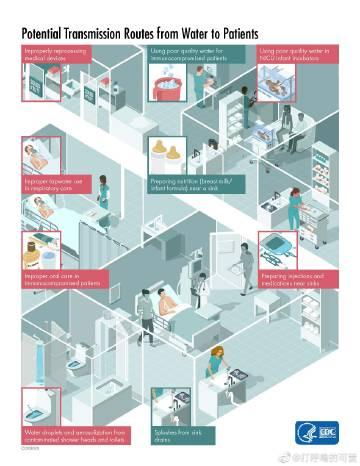
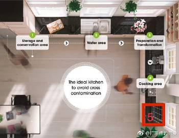
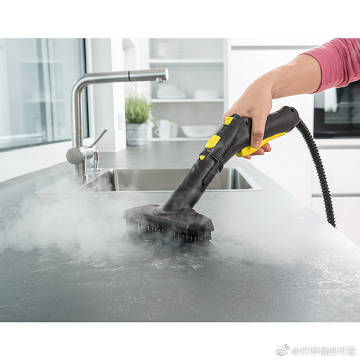
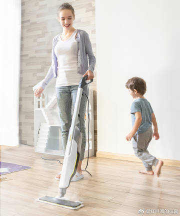
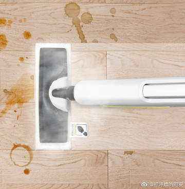
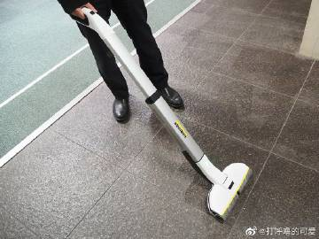
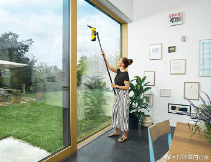
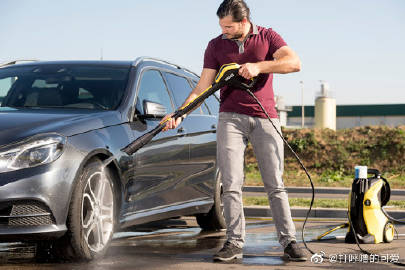
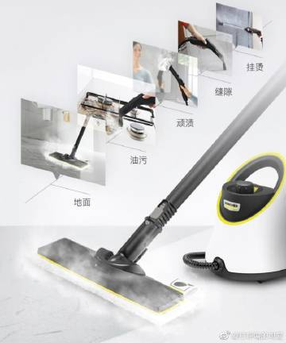

  《厨房的清洁区、缓冲区、污染区》

如果你有亲友在医院/诊所工作，或者你在这次疫情期间查看了很多新闻，就会知道医院里面有【清洁区、缓冲区和污染区】。

在医院/诊所里面，有
污染区：已经被病原微生物污染的区域；
缓冲区：可能被病原微生物污染的区域；
清洁区：没有被病原微生物污染的区域。（图1）里面展示了在病人和病人之间通过水，有可能发生的疾病传播途径

同样，我们也可以把类似的概念应用于家庭厨房的管理，以此使得你的储藏食材、烹饪和备餐更加干净卫生。（如果你生在印度长在非洲/直接喝恒河水面不改色。那就别浪费时间了，不用阅读此文，请出门左拐![[允悲]](images/2018new_kuxiao_org.png)）如果你家有孕产妇/老人/婴幼儿/学童/免疫力比较弱的家人，或者你希望提高一下生活品质和家庭卫生，那么这篇文章会比较适合你。

（图2）这是一个很典型的厨房设计。
在1号位置，可以堆放采购回家的原始食材（拿出来这顿就要做的份量，而不是把一切都堆在那里），或者是在超市接触过很多人的手的食品外包装
在2号位置，可以拆除外包装、对各种果蔬进行清洗；
在3号位置，可以进行对已清洗食材的加工（削皮切丝腌制等等）
在4号位置，可以进行对已加工食材的烹饪。
在5号位置，你可以暂时摆放已烹饪食材或者是处理需要进行无菌操作的食材。例如
a，给婴儿冲调奶粉/米糊/谷物糊
b，或者是给幼儿做辅食（比如蒸南瓜煮了饺子，准备放凉到不烫的程度）
c，或者是给客人泡茶、滤咖啡、榨果汁、做了大锅饭但是要准备小份儿的分餐、
d，或者是解冻“已经烹饪好的食材”以及直接可食用的食材（比如解冻冰激凌蛋糕），
e，调酒，给已经制作好的食物摆盘（比如卤好的牛肉要装盘、烤好的面包蛋糕要切片）
那就都应该在这里进行。

每家每户的厨房布局都非常不同，但是在使用的时候基本原理，就是应该注意：
A，你所有东西的摆放、工作的流程、厨房工作台的设计，都应该有一个内在的逻辑在里面。都需要符合污染区、缓冲区和清洁区的基本概念。

比如你给婴幼儿冲奶粉，已经消毒后的奶瓶和已经冲好的奶粉就应该放在位置5。如果你把它放在位置1/2/3，都有可能被（洗手洗菜时）飞溅的水再次污染。

厨房的流程安排，从左到右（或者从右到左），要符合污染区、缓冲区和清洁区的基本概念。从上到下，依然要符合。比如，你在厨房的橱柜里面存放干净的锅碗瓢盆案板，你就应该放在比较靠上、不可能接触污染物的位置。如果你安排厨房垃圾桶，也应该安排在比较靠下的位置，比如橱柜里面水池下方的位置。这种情况下，厨余垃圾也不会接触“已烹饪好的食材”

B，在有可能交叉接触的时候，需要更换烹饪器材 & 洗手

如果有人拿一块案板，A面当“切生肉剁肉馅”的案板，B面当“切熟食”的案板，给案板翻个身就当完全卫生了，这是错误的概念![[允悲]](images/2018new_kuxiao_org.png)。纯属自欺欺人。

C，避免让已被污染的工作台与已烹饪（包含直接可食用）食材接触；
D，处理原始食材之后，需要打肥皂洗手并擦干之后，才能去接触其他物品；比如说，你早起洗手擦干，打开冰箱门拿了2个生鸡蛋，准备做黄油炒蛋，等你拿了2个生鸡蛋以后，如果不洗手再去取干净的碗（就需要再碰一次橱柜的门，再摸一遍一摞干净碗，从里面取出来一个，这样你就又把干净的碗污染了）。正确的顺序是你在洗手擦干后先准备好做鸡蛋需要用的各种干净的炊具厨具。然后再去拿鸡蛋，避免这种可能发生的污染步骤。
E，不要反复使用脏的厨房抹布、厨房纸巾；买上多条厨房抹布，用一用就扔到脏衣篓里攒够一篮子半篮子就可以高温洗涤。
F，不要清洗禽肉，最好不要清洗大块肉类（飞溅的血水会污染墙面、水池周边的操作台的台面、水池周边的地面等），如果怕血腥气，直接“飞水/焯水”（烧一大锅开水沸腾后，把肉扔进去，过一段时间再捞出）；
G，减少化学污染，在厨房里尤其要注意。不要用杀菌洗手液、杀菌肥皂洗手。只用普通肥皂香皂洗手液即可。尽量不用各种消毒水擦洗餐具、擦洗厨房、擦洗厨房的工作台面，尽量不用消毒水洗厨房抹布，而学会【用高温来进行无残余无污染的消毒】。因为最后这些消毒水或多或少都会被你和你的家人吃到肚肚里、你自己吸到肺里。清洗厨房抹布以及围裙使用高温洗衣机，擦洗厨房台面/厨房地面/厨房水池/冰箱抽屉和隔板尽量使用蒸汽机、洗锅碗瓢盆案板尽量用洗碗机。在如果实在不方便安排这些机器的情况下，再考虑烧一锅开水，开水烫煮你能烫煮的东西。在实在没有选择的情况下，再使用化学药剂。
F，在打扫卫生或者收拾厨房的时候，从高到底，从净到污的顺序去收拾。从清洁区到缓冲区，最后收拾污染区。
G，同样在家庭玄关设置，包括冰箱里面食材的摆放也可以引用这个“污染区缓冲区清洁区”的概念、比如说，冰箱里面食材的摆放从上到下的顺序，就应该是可直接食用食材—>原始食材。比如说生的肉/鱼，你上午买菜买好了（准备下午烹饪），以后就应该把它搁在冰箱的最下层抽屉里，而不是应该把它搁在冰箱的最上层。
H，避免厨房&食物交叉污染有很多环节的要素：烹饪食物，存储食物，用具卫生，环境卫生，烹饪者本人也要注意个人卫生，正确清洗&处理原始食材。
I，重要性上来说【干燥>清洗】，时间顺序上来说【先除污，再消毒，最后立即进行干燥】。如果你洗完的碗，湿乎乎的摞在一起，最后依然会发霉滋生细菌霉菌。家庭湿度应当尽量控制在在40-50%内，厨房墙缝/水池边/案板上不要发霉长黑毛。花几百元花五分钟就能买一只口红发朋友圈，每个人只要有智能手机就能掏出这几百元。但是厨房的安排做到科学、干爽、清洁、卫生、有逻辑性、无化学污染、人性化、举一反三，却需要长期资金的投入，和善用智慧/善用工具/还有对自己对生活对家庭的一片爱心。

——————————
【蒸汽机】
卡赫的蒸汽机能提供大压强的高温蒸汽，在没有化学污染的情况下，帮你进行家庭清洁&消毒，一起完成。高温溶解油污，高温杀死细菌病毒，大压强能提供强大的喷气。钢丝球，会擦坏橱柜表面，也不能杀菌消毒。学会扔掉钢丝球，不要挥舞旧牙刷，不要用旧秋衣/旧苕帚苗去擦一切、也不要相信“老陈醋擦一切都可以消毒”的江湖传言（如果你用的大理石台面/地面用老陈醋擦一擦，就会擦花了。。。）社会在进步，清洁工具也在进步。人人都知道，手机需要换代，家里的清洁工具（如果是破烂儿）也应该换代。如果你是大学生刚离开父母准备逐步置办，可以考虑SC1，比较小也便宜。除此之外，起码也应该买个SC2D。如果房子更大，经济有余力，还可以考虑SC3、SC4，家用最大的是SC5。家庭面积越大，就应该考虑用越大的蒸汽机。这些都是可以长期使用的家电，初次投入比较高，但是平均算下来，今后比较省钱。（数字越大，代表水箱越大，蒸汽的压强也越大，最小的那个sc1不适合大面积，需要不停的灌水/烧水/等蒸汽，打扫一下大学宿舍的床位附近还行。）

【蒸汽拖把】
家里有刚学习吃辅食/学用餐具的小宝贝，婴儿需要经常摄入优质红肉（含铁含锌），最优的选择不是靠吃铁片或者高铁米粉去补铁。所以很多新手宝妈都给宝贝准备了猪肉牛肉羊肉的自制香肠/肉丸。但是小宝贝手眼协调还不好，抓不稳，吃饭会扔一地。猪牛羊肉的油脂，落在地上会很难擦洗。如果你每顿饭后，都准备把地面快速的蒸一下，你可以考虑卡赫的蒸汽拖把SC2 UpRight

【擦地机】
如果你计划经常拖地/擦地。除了蒸汽机也可以考虑有牵引功能的擦地，有线的是FC5（功率比较大，擦的比较干净，但是就也比较沉，有线），无线的有FC3D（功率略小，适用于120平米以内，比较轻便，无线），因为有牵引力，所以擦地无比轻松。

【无线吸尘器】
如果你准备经常洗一下角落的蜘蛛网或者楼梯和踢脚线，那么你就需要一个无线的吸尘器。

卡赫推出的最新款的无线吸尘器VCS4，更轻便吸力超强。电池续航更加强力。卡赫从推出无线吸尘器来这么久，他们的售后部门就基本上，没有听到过对电池的投诉。所以， 如果你准备买无线吸尘器，但是又担心【一过质保期以后电池就不给力】，比如某些品牌，那么你就可以考虑购买卡赫，因为基本没有广告，所以性价比超级高![[允悲]](images/2018new_kuxiao_org.png)，表现一定不会让你失望。里面内置HEPA滤芯，避免做家务的人再次吸入微小颗粒。

本次的双十一活动促销力度最大的两款产品是
1，蒸汽机SC4（每买一台SC4，会赠送1台卡赫无线吸尘器VC4）。
2，拖地机FC3D力度也很大（基本上是平时的半价）。
其余呢，所有的机器都是全年最低价。如果你曾经还犹豫过，那现在就别犹豫了![[允悲]](images/2018new_kuxiao_org.png)再犹豫的话，就要再等一年，才会有“双十一”力度这么大的活动。

—————————————
【活动店铺】：tb的“Karcher卡赫电器旗舰店”
【活动日期】：即日起-11.11.2020（中国大陆）
【团购口令】：【卡赫电器，领跑双十一】
【粉丝福利1，购机有礼】：在该店铺，发私信给客服mm正确的口令，就可以在双十一的所有活动的基础上：
A，每买一台蒸汽机，就会多赠一个刷头。
B，每买一台拖地机，就会多挣一瓶清洁液。
C，每买一台有线吸尘器，就会多得到配套的尘袋，
D，每买一台无线吸尘器，就会多得到配套的HEPA滤芯，防止可能出现的二次污染。
【粉丝福利2，转发抽奖】
转发此微博的朋友，无需关注我，都可以参与抽奖。会有1位朋友获得卡赫价值¥399的滤水壶1台，卡赫公司会帮你邮寄到中国大陆的任何地址。开奖日期为11.01.2020中国大陆时间晚23:45

3，【粉丝福利3：最高订购额者】
在报本次口令并在本次活动店铺购买卡赫的所有朋友里面，于27.10-11.11.2020期间在该活动店铺同一用户账号购买到最高订购额者，ta会获得1台价值599元的轻便型的“卡赫除螨真空吸尘器”。

如果你给自己的小家庭买到了卡赫蒸汽机，请记得也问一下你的亲友/父母/同学/邻居是否需要，帮不擅长网购的长辈购买，也帮他们提高一下生活质量，帮助他们也学会家务现代化，我父母学会了用卡赫的蒸汽机以后，也把钢丝球扔进了垃圾堆。长辈也是愿意用新东西的，省力省事还更卫生，何乐而不为呢？只要有人教教他们就行。助人助己，全家卫生。这个“卡赫除螨真空吸尘器”![[心]](images/2018new_xin_org.png)在等着你（一言为定）。

【本次活动的所有解释权归于卡赫。非常感谢卡赫市场部一直以来给“可爱谈家务”话题的粉丝提供奖品赞助！】 [抽奖详情](https://lottery.media.weibo.com/lottery/h5/history/list?mid=4564998930830389)收起

