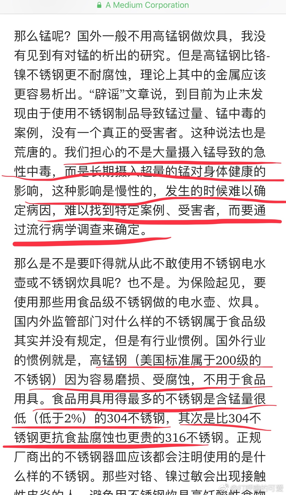

《各档次的家庭不锈钢餐具/炊具的家庭测试》

【实验设计】：
投稿，一名mm买了一个不锈钢测试剂，测试了3类不锈钢。

1，在[#中国#](https://m.weibo.cn/search?containerid=231522type%3D1%26t%3D10%26q%3D%23中国%23&isnewpage=1&luicode=20000061&lfid=4361261015332228)，（产自国内）
1A，从国内带的（超市级别的）不锈钢刀、不锈钢火锅、赠送的火锅漏勺啥的、不锈钢餐具。【餐具&炊具背面没有任何标注】。
1B，在国内网购的，而且不锈钢器材背面，写明了【304不锈钢】的餐具
1C，在国内带的外贸18/10餐具，餐具背面写明【18/10不锈钢】

2，在[#瑞典#](https://m.weibo.cn/search?containerid=231522type%3D1%26t%3D10%26q%3D%23瑞典%23&isnewpage=1&luicode=20000061&lfid=4361261015332228)平价家居店ikea买的不锈钢餐具，（产自国内，但是，Ikea既不标欧标的18/10之类的，也不写国内的304之类的，仅有ikea自己的产品代号）

3，在[#德国#](https://m.weibo.cn/search?containerid=231522type%3D1%26t%3D10%26q%3D%23德国%23&isnewpage=1&luicode=20000061&lfid=4361261015332228)买的WMF、双立人、Arzberg之类的名牌餐具/刀具/炊具，所有产品背面都写明了【18/10不锈钢餐具】，（产自德国）

——————————————————
【实验结果】：

这个药水测了以后：

1A，药水变鲜红，比色结果，含锰量偏高
1B，不变色
1C，不变色

2，ikea的微微变粉红了，比色结果，估计是300不锈钢的级别。

3，不变色。

——————————————————

谢谢这名mm的科学精神、动手能力、仔细分类和各种实验视频![[心]](images/l_xin-43af9086c0.png)。

我就截屏了一下实验结果（不好意思，视频比较大），这名mm准备把她家里变色的不锈钢餐具/炊具都换成起码不变色的。

【实验结论】：

A，无论在国内/在海外，只要不锈钢餐具/炊具的背面敢写【国标304不锈钢、欧标18/10】都是基本没啥“锰超标”的问题的，经济条件允许的情况下，最好全部18/10

B，【国标的称呼简介】：
\- 410 不锈钢（简称“不锈钢”，工业用钢）
\- 430的不锈钢相当于欧标的18-0，比较便宜，有磁性（可以在食品接触使用，不含镍，镍比较贵，也就是不太耐酸碱腐蚀）
\- 201 不锈钢（工业用，非食品等级）
\- 304 B 不锈钢（回收二次用钢）
\- 【304 A 不锈钢】（原材料直接做的食品加工级别的不锈钢）

C，【欧标的称呼简介】
18/8和18/10的意思是钢材里【铬Cr：镍Ni】的比例，铬能”防锈蚀“，镍能“抗酸碱”。欧标18/8在大陆标准被称为304，欧标18/10被称为316（金属性能更稳定，也被称为“医用钢”），镍的价格比较高，18/10就会比18/8略贵，但是18/8也是食品可接触的钢材，没问题的。如果经济实力OK，还是买18/10最稳妥。这是“好 & 更好”的关系（一家人常驻人口最多3-5口吧？配上客人/亲戚/保姆的餐具，8套刀叉勺基本够用，并不会把你的经济拖入万劫不复的地步![[允悲]](images/d_yunbei-a14a649db8.png)）

D，【国产的餐具&炊具，啥也没写的全都“锰超标”了】。比色结果，最鲜红的（超标最严重的）是这名mm买不锈钢火锅赠送的漏勺![[允悲]](images/d_yunbei-a14a649db8.png)，不锈钢火锅质量就一般，但赠品更次![[二哈]](images/d_erha-139d0e07bd.png)。友情提醒，【免费的不锈钢赠品，你要三思而行，不要为了“赠品多”而去买东西】![[二哈]](https://h5.sinaimg.cn/m/emoticon/icon/others/d_erha-139d0e07bd.png)如果你实在喜欢赠品，最好问清楚【赠品的成分】。

——————————————

【注意】：

本文为家庭测试结果，肉眼观察&比色，并非实验室数据，仅供网友参考。

这是这名mm（在自己家）把她家所有（便宜—>贵的）各个品牌的不锈钢制品全部测试得出的结果。

样本空间也有限，无法获得更多不锈钢样品。

谢谢阅读。

- 
- 
- 
- 
- 
- 
- 
- 
- 

316和18/10是适合做餐具的，而且是高级餐具，如图中国zf的网站截屏 //[@是青黛阿同学](https://m.weibo.cn/n/是青黛阿同学)：测了下，确实吸磁铁。我觉得日本人的18/0不锈钢不含镍应该也是因为摄入安全的原因，镍合金是在致癌物清单里的。医用级别的不锈钢虽然更光洁耐腐蚀，但是不适合做餐具的。

