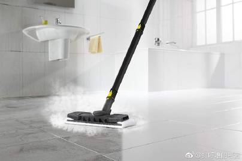

# 《如何打扫卫浴》

每个热爱生活的人都希望自己有明亮洁净的浴室（图1红线上），并不希望自己使用发霉的、有异味的洗手间/浴室。

我们应该怎样打扫呢？我简要介绍一下西欧（德语区）人家一般的做法，如何保持卫浴清洁。首先这一切的前提是如果你装修房子，那就争取这些卫浴产品都买比较好的，釉面光滑、镀层厚度足够、镀层细腻会使变脏的频率&程度大大降低（你买个LV包也不能天天背啊，你买个好卫浴可以天天用）。【工欲善其事，必先利其器。】

## 【重点区域】

### 1，【马桶区域】

做法：
1A，家中男士、男童、男客不可以站着小便。如果站着小便，必然尿液飞溅/家中厕所区域都有异味（准确的说，也就是直径非常小的尿液水珠，在以马桶为圆心的半径很大的范围内都覆盖了这层尿雾，短期是看不出来的，长期就会有异味、发黄）（图1绿线上）。
1B，基于同样的原因，所有人在冲马桶的时候都应该扣上马桶盖子进行冲洗。马桶冲水瞬间带起的飞溅液体也是能达到相当的半径&高度范围，如果不扣马桶盖等于这些飞溅到整个厕所。（图1绿线下）
1C，家里绝对不用任何布艺马桶饰品、马桶棉布坐垫。这些都会积攒皮屑、尿雾、污垢、异味（图2红线上）
1D，长期使用“酸性的挂壁式马桶芳香清洁球”，**尿液是碱性的，你需要酸碱中和**（图2红线下）
1E，长期使用“酸性的蓝色马桶水箱缓效释放块”，这是直接扔在马桶水箱里的，每次会溶解一丁点儿，蓝色用得淡了就代表需要再扔一个进去（图2蓝线下）
1F，在“1D”用完以后需要摘下空塑料壳，再换新的，你可以带一次性塑胶手套去做。如果你不喜欢这个步骤的话，那么就可以用酸性的马桶凝胶。优点是不用扔空塑料壳（图2绿线下）
1G，使用马桶大便的人，必须冲水后掀开马桶盖、以及马桶垫圈去刷没有冲干净的地方。
1H，【每周】彻底打扫，在马桶内壁喷洒“酸性的强力厕所凝胶”，用刷子仔仔细细刷一遍，冲马桶。
1I，【每周】如你不习惯用“IH”的凝胶，也可以用“强力厕所清洁块”，注意：这些东西都是强酸性的，不可以用手去直接接触，都需要带一次性的塑胶家务手套。
1J，【每周】马桶整个区域的墙壁 & 卫生间地面 &马桶盖 & 马桶外壁 & 马桶坐垫的正反面都用喷雾瓶喷洒“柠檬酸溶液”或“白醋/醋酸溶液”。然后让他们作用10-20分钟以后进行高压蒸汽喷雾打扫，你要是没有蒸汽机就必须动手拿抹布擦。无论用蒸汽机，还是抹布，最后【必须擦干水痕】。（抹布也必须学会买很多条，用60-90度高温滚筒洗衣机消毒，否则以“手搓2分钟”的清洁程度，你又等于把污垢细菌在全家搬家了一遍）。不了解蒸汽机的新粉丝，可以看这篇《如何打扫厨房》[网页链接](https://m.weibo.cn/1909203062/4304461478214093)

### 2，【淋浴房部分】

以前写过，请参考《淋浴房的清洁》[网页链接](https://m.weibo.cn/1909203062/4208785575152818)

### 3，【金属部分】

卫生间的水龙头、暖气包、浴室水管、毛巾挂杆都会有很多金属部分。不管你平时再小心，总会积攒一些水垢。擦干净的前提是金属件的质量要好，才可以经得住擦洗，本来薄的就像易拉罐的话，擦一擦就坏了。。。有水垢，可用专门擦金属的“去水垢 & 防水垢喷雾”，德国日化品牌一般敢拿出来卖的都很好用，基本都能擦的干干净净（4）

### 4，【温度 & 湿度部分】

控制家庭起居空间的湿度/温度是生活质量的一部分。我没有见过任何生活在发达国家的中产阶级在冬天把娃和自己在家里/办公室/餐厅里还穿成棉花糖那样。身体自由，穿着不臃肿，呼吸自由（没有霉菌）也是生活质量的一部分。

湿度在40-60%人体感觉舒适。在湿度低于50%的时候，不利于霉菌生长，墙壁/墙缝就不会发霉，螨虫也会死亡。

客卫，在冬季应保持16-19摄氏度；主卫，在冬季应保持20-24度。温度太低，就会造成“湿度过高”，最后墙角/水池边发霉。（5）必须【每天都把家中所有的窗口开到最大限度10分钟】，使空气循环流通。

### 6，【镜面部分，淋浴房玻璃四壁部分，墙壁瓷砖部分】

如果你洗脸的时候，用电动洗脸刷；刷牙的时候，用电动牙刷；每天还用电动水牙线洗牙。。。日久天长，你的卫浴的镜面、淋浴房的玻璃部分就会溅上一些难于擦洗掉的水垢 & 洗涤剂残余 & 油脂的混合物，如果你们家的卫浴是“镜面柜”的话，还会有指纹（图6红线上）。。。这种就可以使用2种方法擦洗：

6A，便宜的方法（清洁速度慢）
玻璃清洁水 & 超细纤维毛巾（图6红线下）

6B，贵的方法（清洁速度快）
使用电动擦窗机（图6绿线下），擦镜面的脏水还能被机器吸回去，配的毛巾可高温滚筒机洗，回收水的水罐可用洗碗机洗，非常方便，擦得特别快。

——————————————
【感谢】

非常感谢卡赫公司的慷慨赞助。

Kärcher公司会给“可爱谈家务”话题的粉丝，【如果你在卡赫公司的直营店购任意机器，并提供“正确口令”的话】会在“双十二”的价格基础上赠送1个小礼物：蒸汽机可配套的刮刀刷（7）

- 
- 长图
- 长图
- 长图
- 长图
- 长图
- 
- 
- 