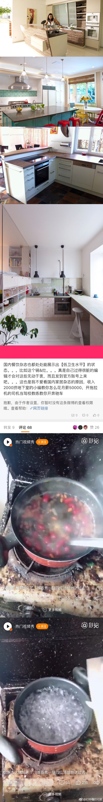
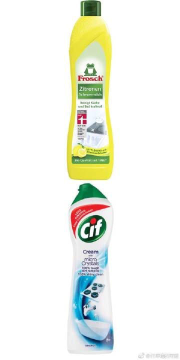
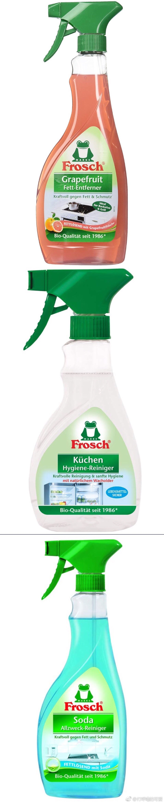
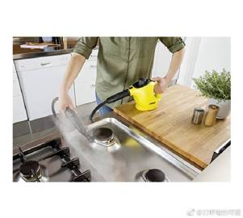
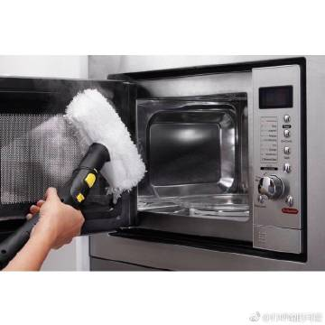
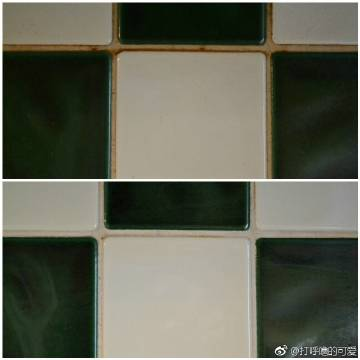
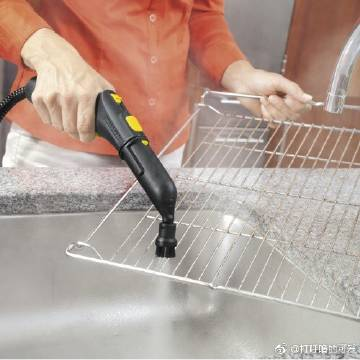
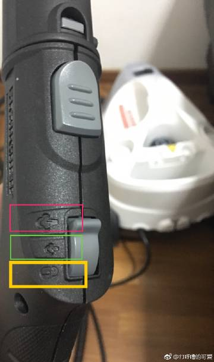
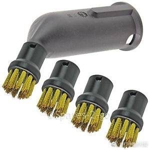

《如何打扫厨房》

如果你经常上网看做饭视频，你就会发现在YouTube上德瑞奥po主，无论厨房新旧&大小都会把家里擦得一干二净。你翻翻国内的美食博主，就时常能看见家里厨房油腻腻/黏糊糊/脏兮兮的![[二哈]](images/2018new_erha_org.png)让人一看就闹心，单单我自己在微博上就指出过多次，如图1。当然也有讲究的人，搞的比较干净。

我每次说“真脏”，就有网友反驳：“中餐就是这样的”。。。其实，【根本不是这样】，如果你使用现代化的工具好好打扫，即使天天在家“油炸一切 & 拔丝一切”都能够把家里搞得一干二净。

1，便宜的方法，【用化学药剂】（优点：便宜；缺点：慢 & 有化学污染）

1A，对陶瓷&不锈钢上面的轻度油污可以用【微晶体清洁乳】（图2）这个里面有非常微小的晶体，就像牙膏能磨擦掉你的软齿垢一样，类似的原理，德国常用的是Frosch、Viss、CIF、各大超市自产品牌（我个人最喜欢用Frosch）注意，【不要摩擦亚克力、有机玻璃、塑料】这些容易留下划痕的表面。。。用这种清洁乳对你家厨具/灶台的质量&镀层是个小小的考验（如果你在发展中国家住）。我有国内朋友买了以后，因为家里租的房子的灶台镀层质量实在太差，居然擦出来了划痕![[二哈]](images/2018new_erha_org.png)我觉得不能赖这个清洁乳的质量，在德国擦灶台从来都没问题

1B，对于比较重的油污，可以用【重油污溶解喷雾】先喷一喷（图3上，这个除了灶台&瓷砖墙壁，还可以清洁烧烤炉/烤箱），然后再用【1A-微晶体清洁乳】

1C，或者【通用清洁苏打水喷雾】（灶台 & 水池 & 水龙头，图3下）

2，贵的方法，【蒸汽机】（优点：快速 & 无化学污染，如果家里有老人小孩，或者你自己的呼吸道也比较敏感&容易过敏，那么“没有化学污染”就是一个很大的优点；缺点：一次性投资比较贵，![[允悲]](images/2018new_kuxiao_org.png)但是如果你天天把家里喷喷擦擦，平均下来那就不贵了。如果你要是半年搞1次卫生，那确实有点浪费![[二哈]](images/2018new_erha_org.png)）

它主要是利用高温高压的蒸汽去喷，可以喷【灶台、壁炉、烤箱、微波炉、烤箱滤网、水龙头、水池&橱柜操作平台的衔接的接缝处、地面、镜面、瓷砖缝隙、推拉门导轨、洗衣机门打开以后的那一圈儿橡皮圈】![[允悲]](images/2018new_kuxiao_org.png)

这是以前投稿的几个朋友，都把家里擦的焕然一新：

2A，刷地缝（先用黄铜刷 & 小塑料刷）[微博正文](https://m.weibo.cn/1909203062/4258944710458999)

2B，刷水池的出水口 [微博正文](https://m.weibo.cn/1909203062/4257810130568361)

2C，擦地板 [微博正文](https://m.weibo.cn/1909203062/4255487137101334)

3，使用蒸汽机，需要注意几个小事项&小技巧：

3A，你在水罐里面应该加【室温干净的自来水】，不要在里面放清洁剂&白醋&香水&蒸馏水![[二哈]](images/2018new_erha_org.png)这些所有的液体都会放在锅炉里面高温高压煮一遍，如果你倒乱七八糟的水会损害&腐蚀锅炉。

3B，不要对着人&小孩&宠物&自己喷，如果你习惯在家光脚的话，打扫的时候，可以穿上厚棉袜，到处喷喷喷打扫。要提前告诉家里老弱小【在高温高压蒸汽打扫的时候，注意不要乱跑乱撞乱溜达】，做家务也应该是【安全第一】。

3C，当你在清洁不同表面的时候，需要换不同的刷头，还可以调整杆子的长度。【请自己读说明书，以说明书为准】。

3D，蒸汽机工作的时候，你也可以不断电就更换刷头，但是【每次放下刷头/进行更换的时候，你都必须为了操作安全把“安全锁”切换到锁定的位置】（图7黄框）避免误操作、蒸汽灼伤自己&他人。不要摸黑软管，摸硬塑料的手持部分，避免烫伤。

3E，蒸汽机产生蒸汽的量是可以控制的。
有气喘如牛（图8红）
有微微冒气（图8绿）
彻底锁定&不冒气（图8黄）
如果你们家要清洁木地板/你住在潮湿地区，就用“微微冒气”，要不然水痕较大；
如果你们家清洁瓷砖地面/你住在非常干燥的地区，就可以用“气喘如牛”；

3F，德国所有房子都要求每天窗户大开通风5-10分钟的（包括冬季），蒸汽清洁完家里，你也应该把家里所有门窗大开10分钟，避免空气不流通&湿度过大。

3G，拖把头，德国产的东西一般都很注意“清洁的便利性”。脏拖把头，都是洗衣机洗的，耐高温，能洗得雪白 【不要放漂白剂&柔顺剂】 [查看图片](http://wx3.sinaimg.cn/large/71cc2076gy1ft4wnobvmxj20qo1jjtm8.jpg) 要是有预算&家里面积大的话，拖把头可以多买几个

3H，用蒸汽机拖地之前，应该先用吸尘器把家里仔仔细细吸一遍，然后再用蒸汽机拖地。高温高压的蒸汽会让凝固的油污变得很好擦洗，但是你要立刻擦，不能等他再次凉了/再凝固![[允悲]](images/2018new_kuxiao_org.png)

3I，【能买大的，就不要买小的】。sc1/sc2/sc3/sc4/sc5是越来越大，我没有见过1个人后悔自己的蒸汽机买的容量太大了，这就和洗碗机/车/房一样的，最后只有人后悔“买小了”的。蒸汽机是高温高压的，差不多等于你自己拖个高压锅到处乱走，买一个质量比较可靠的很重要。。。

长图

长图

