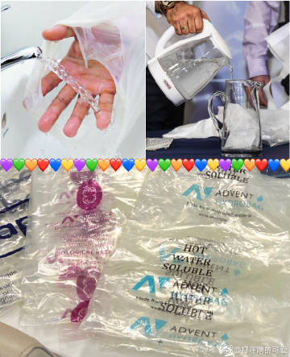
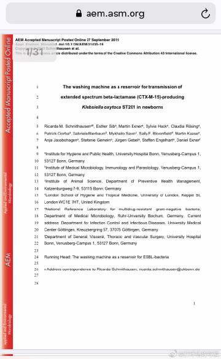
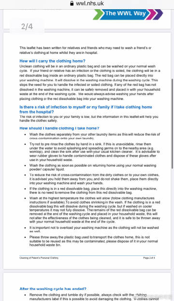
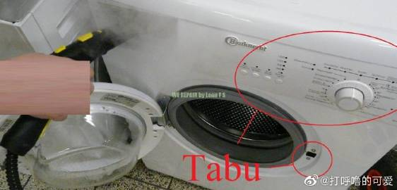
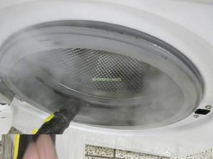
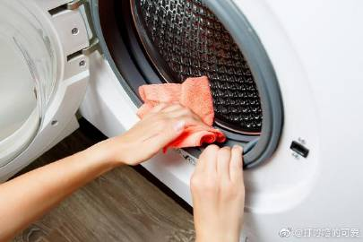
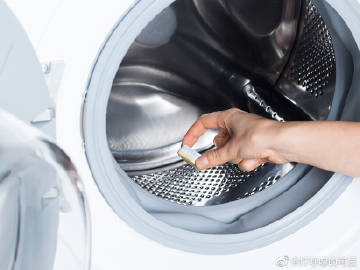
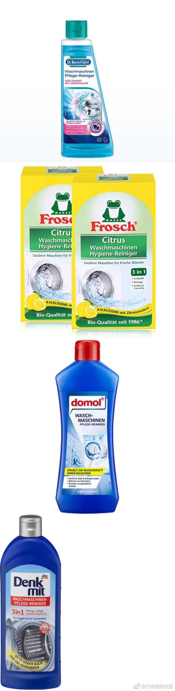
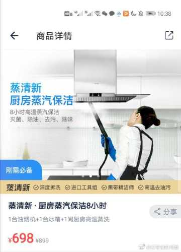

 《对家用洗衣机的清洁、维护、消毒》

家家户户都有洗衣机。我们应该怎么对家用的洗衣机进行清洁，维护和消毒呢？洗衣机会不会变成一个家里的传染源呢？这是大家很关心的一个问题。

答案是肯定的，洗衣机是有可能传播疾病的。比如于27.09.2019发表于美国《应用及环境微生物学》期刊（Applied and Environmental Microbiology，简称AEM）的一篇德国的波恩大学的研究，该研究就是针对（在德国的某个儿童医院里）发生了以洗衣机为媒介的致病细菌的传播，对该院的新生儿的健康造成了危害。（图2）

我们作为普通人，应该怎样保证自己和家人的健康呢？我们应该怎样避免洗衣的时候，让洗衣机作为病毒和细菌的传播媒介呢？

不能用香水、衣物柔顺剂、衣物增香剂来掩盖衣物的馊味、霉味和洗衣机的各种异味。而应该学会用正确的方法处理，最好是能预防异味、霉斑的发生。尽量做到“防患于未然”，而不是“亡羊补牢”。如果洗衣机或者衣物已经有异味，那说明“洗衣机早就需要清洁了”。

现在的大趋势是洗衣机的洗涤温度，最高温度会慢慢降到60度，所以说90-95摄氏度洗涤的都是相对比较老款一点的洗衣机。（他们把洗涤最高温度降低，并不是因为95度的消毒洗涤效果不好，而是因为来自于环保组织、气候保护组织的压力![[允悲]](images/2018new_kuxiao_org.png)）。这对环保有利，但是对你洗涤消毒并没有特别大的利处![[允悲]](https://face.t.sinajs.cn/t4/appstyle/expression/ext/normal/83/2018new_kuxiao_org.png)

【洗衣机中细菌和霉菌】

你打开洗涤剂盒子，可以观察，如果有了小黑点或绿点以及发霉的气味（包括衣物）或洗涤剂盒子中留存有粘稠的液体，就已经可以判断、识别洗衣机需要清洁啦（图5）。

1，【洗衣机清洁频率】
1-1，洗4锅衣服以后，第5锅就需要清洁洗衣机；
1-2，或者是，每2周清洁1次洗衣机（1-1和1-2是哪个频率更高就选择哪个）

2，【洗衣机的安全使用温度】
2-1，为了防止洗衣机内霉菌的形成，应该尽量每次都用60℃洗涤衣物。
2-2，当你的洗涤温度不到60度的时候，可以考虑用含氯的洗衣消毒剂，（但是由于含氯消毒剂对人体的皮肤和呼吸道、包括洗衣废水对环境都有不利因素，所以，第一选择是高温！在做不到高温的情况下，再考虑衣物消毒剂）
2-3，如果家庭成员生病或免疫系统较弱，比如有（0-12个月的）婴儿的家庭，请尽量提前购买能提供90-95度高温洗涤的洗衣机以及能承受90-95度洗涤的纯色棉质织物。家里尽量买一个好一些的洗衣机，把它的功能发挥到最大，这就是所谓的“物尽其用”。而不是在家里买好多个波轮洗衣机，大人一个/保姆一个/宝宝一个，每个都洗不太干净![[二哈]](images/2018new_erha_org.png)，把你的污垢留给你，把我的污垢留给我，每个人的污垢留在各自的洗衣机里。。。总价花费高，清洁效果差。
2-4，如果家里有人患有室内尘螨过敏或涉及顽固的病原体，例如沙门氏菌感染，就起码要60度的条件下洗涤衣物。
2-5，出于卫生原因，所有人的贴身织物都应至少在60°C条件下进行洗涤。 例如，内衣、内裤，床单，抹布、拖把、毛巾。
2-6，如果你在医院的工作是医护人员，并需要直接照料有传染病的病患，或者如果你有父母亲人朋友生病住院（遇到的环境复杂），你去医院陪护/照料他们之前，可以买一点“水溶袋”（在国外是医护人员的周边用品，在国内好像是一种钓鱼用品？很便宜就能买一大堆。图1），每天随身带1个，在医院/诊所里脱掉有可能被污染了的外衣外裤帽子，把干燥的衣物装袋后，扎紧，回家第一件事就是直接把【袋子连脏衣服一起扔进洗衣机，直接选择你的洗衣机的“最高温度”进行洗涤，然后，洗手】。这种袋子是可以溶解在洗衣机里的。这样使用可溶性塑料袋，也是英国卫生部推荐的（在医院/养老院/诊所等复杂环境下）进行探望/护理病患之后/或者你帮病患洗衣服，为了避免脏衣物作为媒介，在健康家庭里面传播细菌和病毒的洗衣操作（图3）。如果你接触的环境复杂，装脏衣服就请不要用普通塑料袋，然后再反复使用这个塑料袋，容易造成交叉感染。
4-4，【使用洗衣机、处理脏衣服的之前和之后，这个处理衣服的人，都应该打肥皂洗手】

5，【洗涤后，如何处理洗衣机】
5-1，洗涤后，应将洗衣机的洗衣粉抽屉保持打开到最大的状态，洗衣机的门也打开到最大的状态，以使设备干燥。 不要给洗衣机罩个花里胡哨的罩子（这样不但不能保护洗衣机，反倒会使里面的部件发霉）
5-2，把洗涤剂盒子取出来，用蒸汽机的喷头，把洗衣机的洗涤剂盒子喷干净；然后再把放置洗涤剂盒子的位置也喷干净；再用蒸汽机的喷头，把洗衣机的门的内侧密封橡胶圈彻底喷一遍（图5）；最后，用一条干净干燥的抹布，把这些湿气彻底擦干（图6）。
        但是要注意不能用蒸汽机喷洗衣机的键盘部分。同时也不能用蒸汽机喷洗衣机的门的卡扣部分，这是为了避免损伤洗衣机的电子元件（图4）。
5-3，【学会科学的生活方式，学会使用正确的清洁用品，请勿在洗衣机中使用醋、醋精、白醋之类的东西，因为它们会损坏设备的橡胶部件】（请参考bosch中国的网站[网页链接](https://weibo.cn/sinaurl?u=https%3A%2F%2Fwww.bosch-home.cn%2Fservice%2Fget-support%2Fwashing-machine-cleaning-tips)，各品牌洗衣机厂商都有类似的提示！不仅仅是某国或者某家品牌的洗衣机“娇气/矫情”![[二哈]](images/2018new_erha_org.png)）洗衣机的清洁剂大约一瓶1-4欧元不等（图8长图），但是大部分都可以用多次，并不是特别昂贵。
5-4，【如果不想添置新东西，可以用洗碗机的洗碗块，用1-2块，用你的洗衣机的最高温度洗涤，用这种方法对洗衣机进行清洗】。为什么呢？因为洗碗块的主要成分是碳酸钠（俗称“大苏打”也是俗称“纯碱”，但是他的本质上是一种盐、它是一个强碱弱酸盐，所以它呈现碱性。所以可以帮你很好的清洁洗衣机），能够溶解油脂和污垢，尤其在热水的作用下会更加明显（图7）。

另外，还应该定期清洁洗衣机的绒毛过滤器（通常是设备底部的挡板位置），并排干所有残留的水。（具体的，下次再写文演示讲解）

长图

