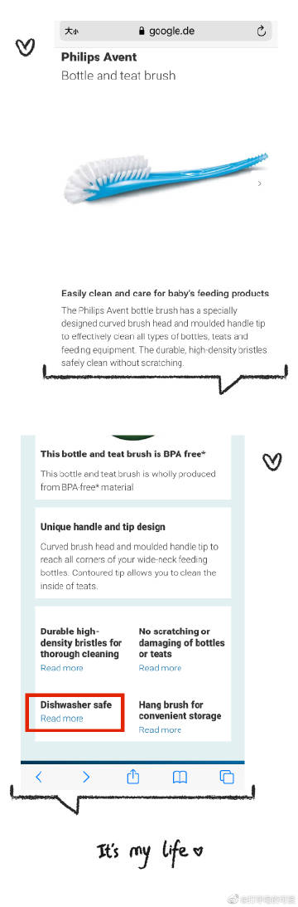

# 一些家庭常用物品的清洁

1，【质量好的塑料梳子】

如果你的塑料梳子质量还不错，天长日久的使用，总会有一些污垢/头皮屑，或者你带着这些出去蒸桑拿游泳，把梳子曾经放在公共区域。

等你准备清洁它的话，可以在彻底清理掉碎发后，放进（海绵比较厚的洗衣袋），再把洗衣袋放进洗衣机里面，正常进行高温清洗。甩干的时候，选择“低转速”，会减少噪音

梳子，也可以在你彻底清理掉碎发后，放进洗碗机，进行高温清洗。（图1）

2，【质量好的塑料玩具】

质量比较好的塑料玩具，比如欧洲常见的lexx和duxxx，都可以装进比较薄的洗衣袋，放进洗碗机进行高温清洗。

如果你要在洗衣机里清洗的话，需要海绵比较厚的洗衣袋，否则会砸的洗衣机很吵，哐啷哐啷响。也是类似的道理，甩干的时候，选择“低转速”，会减少噪音。

如果你没有高温洗衣机、洗碗机的话，也可以用蒸汽机对质量较好的纯塑料玩具进行清洗（图2）尤其是如果有亲戚朋友同学聚会，或者儿童一起约玩play date，如果有的成人或小童后来发现有肠胃感冒、感冒、手足口之类的疾病（首先，如果咱们生病，就最好别去别人家做客/别去探望老弱病残孕婴/不要当传染源也是一种道德！如果事后发现有客人生病拜访了咱们，就也一定要做好清洁工作![[允悲]](images/2018new_kuxiao_org.png)），主人就应该对曾经玩耍的地面、曾经使用过的客卫，曾经用过的玩具，进行高温清洁。注意，【不要满屋子喷酒精！有火灾的危险】你不⚠️

3，【质量较好的擦地巾、拖把布】

质量好的擦地巾和拖把布，也都已经考虑了你的清洁需要。

可以去除大的残渣和头发丝以后，放在洗衣机里进行高温清洗，至少60摄氏度，能达到清洁&消毒的双重效果。

和以前写过的文章一样，能用温度清洗&消毒的时候，请避免使用化学方法消毒，这样对健康更加有利。

比如，卡赫的蒸汽机的拖把布，和擦地机的毛巾滚筒（图3），都可以用60度高温清洗，按照正常的洗涤，哗啦啦洗2小时是不会洗坏的（注意不要使用衣物柔顺剂）。

类似的，欧美品牌的拖把抹布，一般都考虑到了你的高温洗涤需求，都基本可以用高温洗衣机解决。

4，【刷子 & 洗碗布 & 蒸汽机刷头】

家庭清洁也少不了刷子。比如有小孩的家庭，可能有奶瓶刷，还有刷洗碗池的刷子。这些刷子，如果是欧美品牌的，也大多考虑了高温洗涤需求，可以安全地放在洗碗机里清洗。（如图4，飞利X的奶瓶刷，就是洗碗机安全的；如图5，ikeX的很便宜的刷子，也是洗碗机安全的）

欧美品牌的洗碗布，一般也考虑了高温洗涤，所以也有很多“洗碗机适用”的选择。（图6）

卡赫的蒸汽机塑料刷头，如果油污不是很严重，可以放洗衣机高温洗涤。如果油污严重，或者是黄铜刷头，可以在地上铺几层厨房纸巾，然后在油污很重的刷头上滴上一点洗涤灵，再用蒸汽机的喷气喷枪去喷。喷完以后，把地上垫的厨房纸巾一扔就行了。（如果地上不垫厨房纸巾的话，会把油污通过蒸汽到自家地上![[允悲]](images/2018new_kuxiao_org.png)）

5，【棒球帽、太阳帽】

棒球帽、太阳帽上，也会沾有各种化妆品（粉底液）、防晒霜、皮肤的油污。也可以多买一些颜色款式的棒球帽，经常更换，攒够一堆以后，放在洗碗机里进行洗涤。

为了维持棒球帽的形状，也可以使用棒球帽的洗碗机支架，这样，不会让棒球帽洗一洗就趴在一起，能照顾到各个角落。（图7）

6，【安抚奶嘴、细小物品、密度小的物品】
这些细小物品都有专用的洗碗机清洗篮，如果你家有洗碗机，可以购买，比如安抚奶嘴、小的烘焙工具、塑料餐具，都可以有自己在洗碗机里的安身之地。

如果有装不进去清洗篮的物品，也可以用洗碗机专用的网，把这些轻飘飘的塑料制品固定住，防止它在水流湍急中翻身、或者是飘走，阻碍洗碗机下方的扇叶旋转。（图8）

7，【婴儿锅碗瓢盆、婴儿辅食案板】

很多网友都问，应该如何清洗消毒婴儿锅碗瓢盆、婴儿辅食案板。最省事的解决方案，依然是洗碗机。选择60度以上的洗涤方式，不要用快洗模式。另外，也不需要给婴儿买很多单独的锅碗瓢盆、案板。

大人的锅碗瓢盆、案板，平时也应该选购质量过关的/没什么有害物质的产品（你刚买的时候心疼一下，平均到每天的话，其实成本也不高），清洗干净，保持干燥，消毒到直接婴儿可用的程度。而不是家里有一堆不干不净的厨具餐具给大人，然后精心买一堆东西给婴儿（增加不必要的购物成本，占据你家的空间）。

如果家里没有洗碗机，就烧一锅水，煮沸，烫你想烫的厨具餐具。也可以这样通过最简单的方式高温消毒。类似的，最重要的是保持干燥。即使你煮沸消毒后的物品，长期保持于潮湿环境中，依然会发霉。

8，【婴儿洗衣机】
婴儿洗衣机也是不需要的东西，买一个好的高温洗衣机，买一个【无香料、无荧光剂】的低致敏（适合高温的）洗衣粉。洗衣机注意保持开门状态，保持内桶干燥，保持洗衣机的清洁，一周至少高温洗涤一次，按时用蒸汽机清洁一下洗衣机的门周围的橡胶圈。

另外，也不需要手搓婴儿衣服。当父母的人，如果有时间有精力，多和你的小孩“读万卷书、行万里路”，走走停停逛逛吃吃，说说笑笑，读本书，炖块肉，唱支歌。干啥都行。比你蹲在地上吭哧哧吭哧哧的搓衣服强多了。洗衣机90度2小时，比任何人的手都洗的更干净。学会安排生活，学会把任务分摊给更专业的机器去做。不要用无意义的“和机器抢活干”的家务劳动当盾牌，来逃避更大的责任和更重要的任务。这种【整天搓衣服，不陪伴孩子的行为】[抽奖详情](https://lottery.media.weibo.com/lottery/h5/history/index?id=523409&sign=1.13dd244551) 和【上班时间，猛喝水/多次上厕所，去逃避工作】、【学生的学习阶段，疯狂打游戏，去逃避学业】，这些行为，并没有特别本质上的区别。

爱他人的基础始终是【爱自己】。
爱自己，提高生活质量，拥有一定的物质基础，但是又不要变成物质的奴隶；
爱家人，学会给机器分摊任务、正确分配业余时间；
爱父母，帮他们也学会与时俱进的家务理念；
爱小孩，用科学方法管理家庭，尽量提高家务工作的效率，多提供高质量的陪伴。（图9）

每个人的职业、背景、喜好、家庭成员、年龄段、生活方式，都会各有不同。但是，殊途同归，我们每个人都应该尽己所能，给自己和家人提供更优质更好更清洁安全的生活环境。

长图

