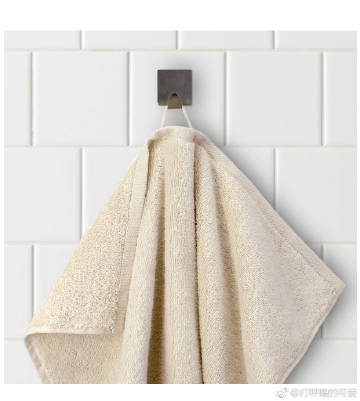
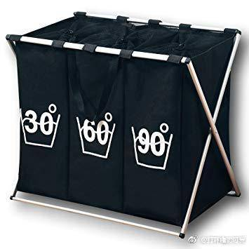
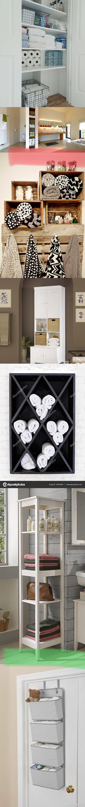
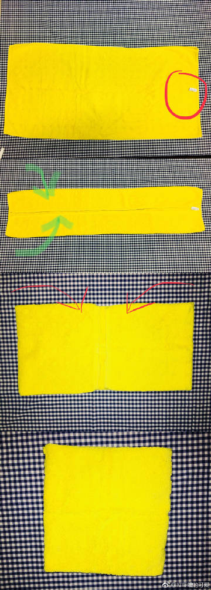
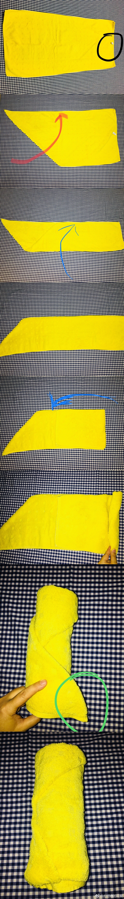

# 《毛巾、浴巾的整理与收纳》

我们每天擦脸擦手游泳洗澡，都会用到毛巾和浴巾。如果你去世界各地住4 - 5星级的酒店，都会有同样的感受，哇，就是人家的毛巾怎么这么柔软细腻蓬松舒适，让人充满幸福感。

1，【毛巾的选购】

首先你要买品质好的毛巾，只有好毛巾才可能保持又软又舒服又有吸水性的质感。你的洗衣机 & 烘干机就是再牛X，也不能把”纱布/帆布/化纤布”给你洗出蓬松舒适感。

欧洲普通人家的生活习惯是，就像选购餐具一样【买一堆好的毛巾（看起来同色/双色/成套），然后正确洗护（高温洗涤/烘干），用很久】。而不是“东一个破烂儿/西买一个破烂儿，家里就像杂货铺一样，每天用着都不舒服，但是我每个月扔两条毛巾”。。。每个人都可以根据自己的情况做出选择。我介绍的是西欧普通人家的生活情况：

1A，一般来说，收入正常的人会倾向于买【质量好的纯棉的长绒毛巾】；

1B，一般来说，欧洲的毛巾买来的时候就会有一个小小的同色棉绳（1），方便你在家里挂一大串儿；

1C，就像酒店/医院一样，因为是高温洗涤过（60度高温滚筒洗涤）& 烘干过，所以【洗完以后/再次使用】时，并不区分“你的、我的、张三的、李四的毛巾”，一般有个大毛巾柜/毛巾架，用2天以后，就自己把脏毛巾扔进90度的脏衣篮里面（2），同时自己去毛巾柜/毛巾架拿干净干爽的毛巾。

1D，如果不用烘干机的话，（在干燥地区的话）毛巾纤维会板结，硬梆梆的刷子一样刮皮肤，（在潮湿地区的话）容易变馊。

例1，[#德国#](https://s.weibo.com/weibo?q=%23德国%23) 一个普通牙科诊所的毛巾柜[微博正文](https://m.weibo.cn/1909203062/4258930836651140) 图7 & 图9

例2，[#中国#](https://s.weibo.com/weibo?q=%23中国%23) 一名医生家庭的mm家里的毛巾柜[微博正文](https://m.weibo.cn/1909203062/4257357107711615)

例3，[#法国#](https://s.weibo.com/weibo?q=%23法国%23)一名mm家里的毛巾投稿 [微博正文](https://m.weibo.cn/1909203062/4297202136580200)

这些都是非常美好的例子，让我们知道“哦，生活可以这样经营”![[心]](images/2018new_xin_org.png)

2，【毛巾的收纳】

2A，一般德国产的很常见/普通的毛巾的大小规格是W*L = 50cm * 100cm，浴巾是 80cm * 150cm （起码我自己买的都基本是这个规格的，当然各个国家/各个品牌都有自己的尺寸，不用纠结）

2B，【毛巾收纳家具】：

2B-1，【最优选择】：如果你的房子是自己买的（可以随便大刀阔斧），地方充裕而且自己新装修，你在设计浴室/储藏室的时候，就可以设计上毛巾收纳部分。（图3长图的红线以上）

2B-2，【较优选择】：租房的话，可以买一个毛巾柜/毛巾架（图3长图的红线以下）各种各样都有。贵的也有，便宜的Ikea 就有，或者海外普通大超市其实也有，丰俭由人。

2B-3，【经济选择】：如果经济比较紧张，住宿空间也很拮据，可以搞一个比较结实的无纺布毛巾袋，也是各种各样的都有。（图3长图的绿线以下）

2C，【毛巾基本收纳折叠方法】最基础的一般有2种，你如果更有时间可以折大象、折白兔、折天鹅。。。我拿了一个毛巾举例。

2C-1，【叠被子法】
第1步，把毛巾（横向）平铺在你面前，商标在上（图4-1红圈）；
第2步，毛巾上沿（往下折）折到距离中位线1 cm处，毛巾下沿（往上折）折到距离中位线1 cm处（图4-2绿箭头）也就是说，毛巾上下边缘之间现在相距大约2 cm；
第3步，毛巾左沿（往右折）折到距离中位线1 cm处，毛巾右沿（往左折）折到距离中位线1 cm处（图4-3红箭头）也就是说，毛巾左右边缘之间现在相距大约2 cm；
第4步，把上一步折好的毛巾对折（结束，出来就正好是一个四方块儿，图4-4）

2C-2，【卷筒法】
第1步，毛巾铺平，商标冲上（图5-1，黑圈儿）
第2步，“毛巾的左沿”折到“毛巾的上沿”的位置去，使之成为“直角梯形的形状”（图5-2，红箭头）
第3步，“毛巾的下沿”折到“毛巾的上沿”的位置去（图5-3，蓝箭头）
第4步，毛巾翻身，使“毫无折痕的那一面”对着你（5-4）
第5步，“毛巾的右沿”折到毛巾总长度约2/3处（5-5，蓝色粗箭头）
第6步，双手一起卷“毛巾的右沿”向毛巾最左侧的尖角处卷，尽量双手卷的紧凑而用力，否则卷筒很容易散架（5-6）
第7步，卷到最后，毛巾最左侧的尖角会出现在“卷筒下沿”（5-7绿圈儿）把尖角掖进毛巾下沿的皱褶处掖紧即可（成品就是5-8的样子）

（卷筒法，是我平时去游泳、泡温泉、健身最喜欢的携带毛巾的方法，因为不容易散架。。。非常节省运动背包的空间。。。叠被子法，比较适合搁在家里的毛巾柜里面，稍微一抖就散架啦。。。）

我科普的是居家生活里面最基本毛巾/浴巾收纳方法，如果你没有这方面的家务基础的话，希望这篇短文有帮助到你。

长图

长图

