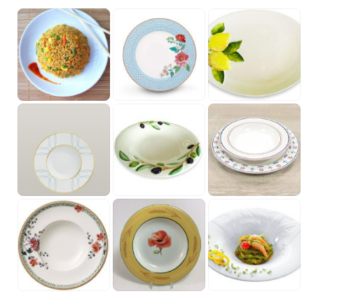

# 洗碗机盘子

如果你用洗碗机的话，一般就会非常倾向于用盘子（盘子排列起来省地儿）。

很多人说“中国人爱吃米饭，就是必须要用碗”。

不是啦。你还有以下2个方案![[挤眼]](images/2018new_jiyan_org.png)

1，【平盘吃饭 & 1个碗倒扣米饭】

如果有一堆人吃饭，你可以拿一个“公用碗”盛出来米饭，然后倒扣在每个人的“平盘”里面。（图1-3）

2，【深盘吃饭】

盘子也不是只有“平盘”可以选择，你也同样可以选择“宽沿深盘”（图4-9）。

【功能性】可放沙拉/意面/西餐的汤（西餐汤常在盘子里吃）/米饭炒菜，又像盘子又像碗；

【实用性】碗需要倒扣在洗碗机里面特别占地方，这种盘子就可以插进放盘子的位置而不用倒扣；

【美观性】盘子大了显得高大上；盘子小 & 堆得过满就显得比较土鳖/局促/难看。比较好的西餐厅/比较讲究的家庭会用这种盘，有“留白”才好看，相当于人家瓷器公司已经给你裱起来了漂亮的画框，你只需要里面再填描几笔，就是一幅美丽的画卷啦。

———————————

很多家庭做饭水平已经非常高了，【美食应该配美器】。厨房、餐桌应该和美好的记忆联系在一起![[鲜花]](images/2018new_xianhua_org.png)![[爱你]](images/2018new_aini_org.png)。

如果没有条件，也就罢了，我很理解人生有很多阶段。。。但是如果你有条件的话，应该尽己所能，让自己 & 家人的生活变得更美好更幸福更有仪式感。

成套的漂亮餐具（乍一瞅有点儿贵）但是可以用一辈子，比起“东买一个/西买一个”会更让你的家庭小餐桌更美。

