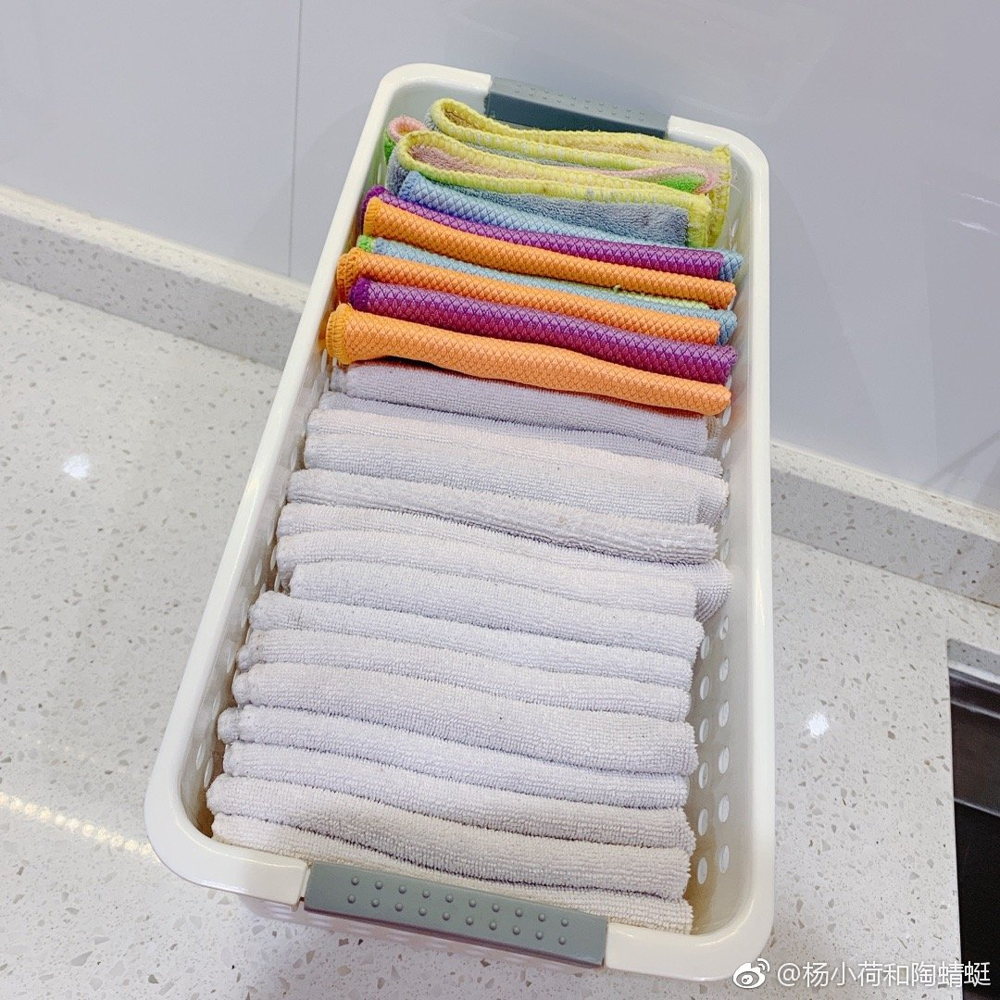

俺们昨天从鸡汤营销故事，扯到了助听器，又扯到了洗衣机。。。

我在德国从来没有见过任何一个人拥有洗衣机的人在【洗袜子/洗内裤】。就连在大学宿舍里面，大家都没有洗衣机（都用全楼公用的投币洗衣机），也都是袜子/内衣/外衣一起在洗衣机里洗。

我从来没有听过任何人因为用自己的洗衣机“同时洗了自己的外衣/内衣/袜子”而患病。在德国，大家并不是专门“袜子攒一桶”洗，而是“分颜色”攒脏衣物。一般分4桶脏衣物，花色一桶（40度/彩色洗涤液）、黑色一桶（40度/黑色洗涤液）、白色一桶（40度/白色洗涤液）、毛巾一桶（90度/彩色洗涤液）。。。比较讲究的人还能再分出来一桶“红色衣物）

回国的时候，听见有一个朋友（家庭条件还挺好的/家里地方也大），她说她买2个洗衣机：“给宝宝一个洗衣机，我们两个大人用一个洗衣机，因为大人的衣服脏，小孩的衣服不脏。”。。。我还有另一个朋友她教自己的小孩如何洗袜子/洗内裤，他说他小孩每天都要洗袜子/洗内裤（我的内心在呐喊【你为什么不让娃干点更有意义的事情】）。。。

事实上，洗衣机洗的又干净又省水。认为洗衣机洗的不干净，【袜子和内衣内裤非要用手洗，绝对是一个陋习】。这些洗衣粉/洗涤剂都足以去除脏衣物的油脂/蛋白质/污垢/细菌，而且如果你实在信不过你自己的洗衣机，还有【洗衣消毒液】、而且现在的洗衣机也都能选择【高温洗涤】

就像你睡觉的时候，床单被罩也是一整个床单/一整个被罩，并不专门把脚和身体其他部位分开。你要是去泡澡/游泳，那么在浴缸里或者在游泳池里，也没有专门搁脚的地方，我也没见过人因为“我和我的脚一起泡澡/游泳了”而生病。。。

真的，朋友们，开始用洗衣机洗袜子/洗内衣吧【完全没有必要把这些衣服分开】。。。人生这么美好，有时间为啥不和家人聊几句/唠唠嗑呢？有时间为什么不给自己做个面膜呢？有时间为什么不去吃点水果跑跑步读本书呢？为什么要把生命浪费在机械的/重复的“和洗衣机抢活儿干”这种吃力不讨好的事情上？

P.S.我并不是把我自己都不相信的理论来给安利给网友们哈。我本人一直把袜子/内衣/外衣一起（用洗衣机）一起洗，完全健康。

//[@SNH48一诸葛二狗](https://m.weibo.cn/n/SNH48一诸葛二狗)：洗袜子就别用洗衣机了吧，水费电费不花钱的哦![[允悲]](images/d_yunbei-a14a649db8.png)而且你得攒多少袜子啊//[@铁皮人阿宅美国队长点](https://m.weibo.cn/n/铁皮人阿宅美国队长点)：其他同意，洗衣机不同意//[@走向死亡的路上花儿却越发艳丽](https://m.weibo.cn/n/走向死亡的路上花儿却越发艳丽)：说是洗衣机啥都洗，会混入细菌啥的，反正我自己的都洗衣机~![[二哈]](images/d_erha-139d0e07bd.png)//[@宇宙圣母教程心](https://m.weibo.cn/n/宇宙圣母教程心)：内衣内裤这事儿，我老婆一直坚持手洗。

https://m.weibo.cn/status/4166400035418436

内衣裤就不拍了，这是我洗衣机90度+烘干机洗出来的抹布。独居，3-4次/周开洗衣机，一次90度洗抹布，一次60度洗内衣裤毛巾，一到两次40度洗外衣；每天开洗碗机智能马桶。电费真的不贵，100+元/月。

