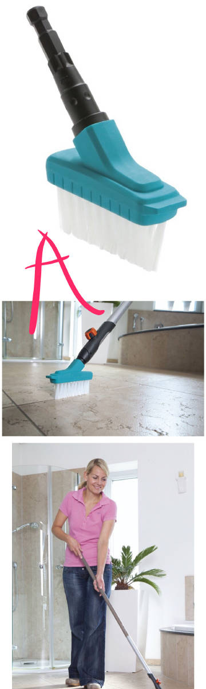

问：[@熊的蜜](https://m.weibo.cn/n/熊的蜜)：请教一下，淋浴房玻璃用什么洗？

答：

情况A：玻璃淋浴房干净的时候很好看，亮晶晶的。
情况B：但是，使用时间长之后，如果不注意清洁玻璃的家庭，就会有水垢，看起来就不好看了。
情况C：最保养不良的情况，就是也不擦洗水垢，而且每次洗完澡以后也不通风，就会在家里的墙角/地砖缝甚至是墙壁/窗户腻子上都生长很多霉菌。霉菌不但看起来很恶心，而且会随着空气流通进入肺部，对呼吸道都会非常有害。（如以前链接[网页链接](https://m.weibo.cn/1909203062/4169445909754277) 图4，有的网友家何止墙壁，就连案板都发霉了）

1，【每天的功课】

你如果需要家里的玻璃淋浴房保持干净，就必须要求【每人每天洗完澡以后，都 [ 立刻 ] 用一个“淋浴房刮玻璃器”去刮一遍所有沾了水的墙面】，这种“淋浴房刮玻璃器”（德语叫Duschkabinenabzieher或者Badabzieher，英语叫shower Wiper）。

比较好看的都是不锈钢的（图1A）；
比较便宜，没那么锃亮闪烁的是塑料的（图1B）。他们起作用的地方，刮墙壁的都是那个最顶部的“橡胶刃/硅胶刃”德Wischlippe英rubber blade（比如图1的黑色部分）。这个“橡胶刃/硅胶刃”会老化/变脏，每6个月应该起码换一次“橡胶刃/硅胶刃”（图2）

这个“淋浴房刮玻璃器”也可以刮玻璃幕墙表面（图3A），也可以刮洗澡间瓷砖表面（图3B）。所有只要沾了水的墙壁都会积攒水垢，都应该刮一遍。

“淋浴房刮玻璃器”可以通过一个双挂钩“正挂”在淋浴房的玻璃上方（图4）；也可以通过一个吸盘式的挂钩“倒挂”在玻璃的表面（图5）；如果房子是你自己的，你还可以钻孔安装在浴室墙壁上。

最重要的是，全家每天最后一个洗完澡的人都必须立刻把墙面刮一遍，然后必须打开窗户通风10-15分钟，避免“温暖潮湿”的环境下在浴室滋生霉菌。如果是潮湿地区的冬季，必须把房子加热到相应温度来防止空气湿度过大，还应该在家里放置除湿机（贵一点）、除湿剂（比较便宜），在这篇里面介绍过[网页链接](https://m.weibo.cn/1909203062/4169445909754277) （该链接图3）。

2，【每周的功课】
周末的时候，在玻璃上/瓷砖上喷上“浴室清洁剂”（图6），然后再把积攒下来的水垢再用超细纤维抹布擦擦。这种抹布也有2种：一种是直接配套与“淋浴房刮玻璃器”一起卖的（图7A，这种可以拆成2个东西用，非常省事儿）；一种是单独的（图7B）

水垢，也叫水碱（主要成分碳酸钙CaCO3），这些浴室清洁剂一般都是酸性的（为了酸碱中和），为了避免腐蚀皮肤/吸入肺部，你最好【戴个橡胶手套、保持在浴室通风的情况下】进行清洁。

3，【每月的功课】
除了墙面，地面也会积攒污垢、尤其是地砖缝，也都应该喷上浴室清洁喷雾（图6那些）/或者除霉喷雾（图8），然后用专门的“地砖缝刷”Fugenbürst来刷墙缝&地砖缝。

我知道有的家庭会用废旧小牙刷来刷地砖缝，但是用牙刷，你必须蹲着才能擦洗，牙刷手柄也很短小不好用力，这种专业墙缝刷有延长杆（图9A）也有可以抓握的手柄（图9B），而且刷毛比牙刷大多了，非常容易用力。

这些浴室清洁用品，德国一般中产家庭常用的品牌有Vileda，Kärcher，Leifheit。或者你去网上亚马逊/DM/Obi/Toom超市翻翻

——————————————————————

【工欲善其事，必先利其器】。

【高温洗衣机/烘干机/洗碗机/好牌子的洗衣粉这些专业的清洁用品、家务现代化用品并不是家庭主妇/全职爸爸专用产品】，职业妇女/职业男士空闲时间少，更应该选择质量好的产品来提高自己的劳动效率，做到“事半功倍”。本来下班就很累了，还要吭哧吭哧洗洗刷刷，何苦呢？

- 
- 
- 
- 
- 
- 长图
- 长图
- 
- 长图