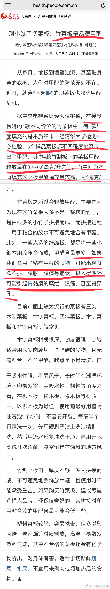

# 案板/砧板/菜板的使用

在我微博里，常看见在家务话题的杠精，每个杠精都自以为“有洁癖“，图片都是他们发微博介绍如何烹饪&家庭生活的照片，但统一的特点就是无论杠精身处大江南北，都有标配就是【脏的吓人的案板】（大家不要害怕，即使意见不同，一般我不也翻看&截屏他人相册，除非跑来主动抬杠/吵架/骂街的）

例1，发霉案板，如长图 [查看图片](http://wx3.sinaimg.cn/large/71cc2076gy1fw28hgjihkj20qo2muao0.jpg) ；

例2，发霉的案板&看不出颜色的抹布 [查看图片](http://wx2.sinaimg.cn/large/71cc2076gy1fsnivol2gdj20qo1bftgd.jpg)；

例3，包浆案板[微博正文](https://m.weibo.cn/1909203062/4254052788873619) 链接中的图1；

例4，发霉案板上揉面做花卷儿 [查看图片](http://wx3.sinaimg.cn/large/71cc2076gy1fskhs38o2hj20qo3miqnu.jpg) ；

例5，发霉长毛的案板切苹果[微博正文](https://m.weibo.cn/1909203062/4169445909754277) 链接中的图4

我找的照片是不是“个例”呢？不是，【中国家庭的厨房的生熟案板&刀具分开的比例不足1/3】，数据来源：[食品安全机构：厨房生熟不分是致沙门氏菌食物中毒主因](https://weibo.cn/sinaurl?u=http%3A%2F%2Fapp.ceweekly.cn%2F%3Fapp%3Darticle%26controller%3Darticle%26action%3Dshow%26contentid%3D103494) 

所以，并不是【在家做饭就干净】，如果你家的案板都发霉/长毛/包浆了，那还不如去麦当劳KFC星巴克去随便吃点啥垫垫肚子呢。你要保障接触食材的器具都卫生，才有【在家做饭是干净的】讨论基础。

如果你希望改善厨房卫生水准（案板方面），让我来介绍一下德国/西欧的普通家庭是如何做的。

1，【案板的材质】
1A，【耐高温塑料】（无论你家有没有洗碗机都最好选择耐高温塑料，比如你烧锅开水想烫一下案板，正常人也不希望渗出有害物质吧？）；
常用的2种耐高温塑料，
         1A-A，一种叫【美耐皿】也叫“密胺”，学名是“三聚氰胺甲醛树脂”（melamine-formaldehyde resin）。
         “美耐皿”餐具/案板在国内很多 & 很便宜，但是，廉价/劣质美耐皿餐具30度就能释放三聚氰胺，而且还能释放甲醛，长期使用会肾脏受损，对儿童/老人/孕妇伤害尤其大。
         廉价“美耐皿”对人体有害，更可怕的是【在全国上千家密胺餐具生产企业中，只有90余家取得生产许可证，获证比例仅1成。而不合格的密胺制品大多因使用脲醛树脂生产，致使甲醛超标或其使用性能中耐湿热性不合格。】数据来源：[密胺餐具安全解读](https://weibo.cn/sinaurl?u=http%3A%2F%2Fpaper.people.com.cn%2Fxaq%2Fhtml%2F2012-08%2F02%2Fcontent_1109755.htm%3Fdiv%3D-1)
          所以，如果你给家里买耐高温的美耐皿案板，一定要买质量好的，注明“洗碗机适用”的。如图，一些德国的美耐皿案板的设计。（长图1）都很美，一般买4-6个一套（来客人也有一套的案板）。

​          这种一般都是当【面包托盘】用（方便你涂黄油&蜂蜜&软酪之类的），并不用于【切】面包/切菜，因为你切来切去很快表面就会被划花了，划花的美耐皿是不能使用的（当然你用的话，不犯法，但是对人体有害的，长图2）。

​          1A-B，另一种常用的耐高温塑料案板，就是PE啊或者PP啊之类的案板。

​          各大厨具品牌都有，经济条件一般就买Ikea的，经济条件好就可以买各种各样的![[允悲]](images/2018new_kuxiao_org.png)。

​           便宜的品牌，比较普通，就一个塑料板（正反面完全一样）；稍微贵一点儿的品牌，一般设计会稍微有些独特，有的会四周有沟槽，你切西红柿/桃子/西瓜这些汁水多的瓜果蔬菜，不会流的满橱柜都是汤汤水水。（图3，长图，最上面的是那种Ikea 的）。

​           一般来说，稍微贵一点儿的品牌，背后还会有防滑底/防滑条，你不会发生这种“切着滑溜溜的鱼，结果案板居然就自己滑走了”的情况![[允悲]](images/2018new_kuxiao_org.png)。（图4绿圈内，就是我拍的防滑底）。如果你的案板自己就滑走了，那都是因为东西质量太差了。

​            贵一些的品牌，有的表层塑料内也会含有银离子之类的，有防细菌滋生功能，还有的会有强化纤维，不会很快切烂。总之，这些东西（如果在发达国家购买）也都是一分钱一分货的。买好的，用久些，这才是“不浪费”。买个破烂，每月扔，会花更多的钱。

1B，木案板
        
      1B-A，普通的整块儿的木头案板，一般不适合洗碗机，一般家用的是喜欢当牛排/香肠/奶酪案板用（图5）；
      1B-B，那种“经过高温高压定型”的木头案板适合洗碗机，但是都比较贵；
      1B-C，便宜的木头/竹子拼接的案板一般都有很多杂质/残余胶水，并不健康。并不是有个“竹子/木头”几个字儿就代表健康天然的！（图6）

1C，陶瓷案板 & 玻璃
        陶瓷的话，釉中彩&釉下彩都行，釉上彩是对人体有害的。一般是当早餐案板/奶酪案板用。

【案板的用途】

2A，早餐案板/面包案板（A4纸的一半儿大小）。德国人家的一般早餐是吐司、面包之类的。和“平盘”一个用途，给面包抹抹黄油的底托。一桌人吃早饭的话，必须一模一样或者“一套“的案板
2B，牛排/奶酪/香肠案板，一般用橄榄木、胡桃木或者别的啥高级的硬质木头
2C，切菜、切水果、切肉。

3，【案板的使用&消毒】
3A，【有洗碗机的人，无需案板生熟分开】。切某一类东西后，就换一次刀 & 案板，保证“食材不串味儿”即可。国内有的餐厅/人家不太讲究，只分生熟案板，蔬菜&水果并不更换案板，所以水果沙拉还常有蒜味儿。

3B，没洗碗机的人，物理方法：开水烫；

3C，没洗碗机的人，化学方法：用消毒水bleach一瓶盖溶解在2L水里，戴橡胶手套，快速刷洗案板表面

3D，无论你有没有洗碗机，你都应该保持案板处于干燥处。收起

长图

长图

长图

