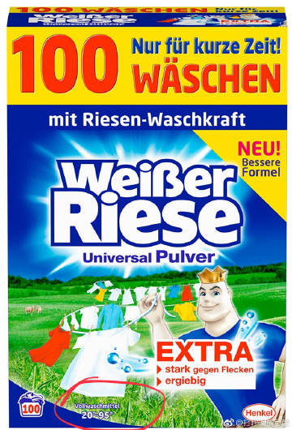
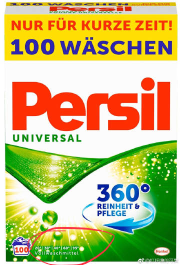
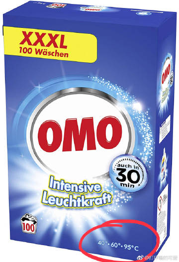
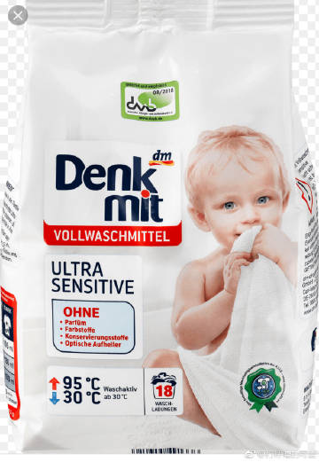
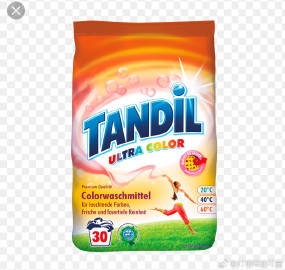
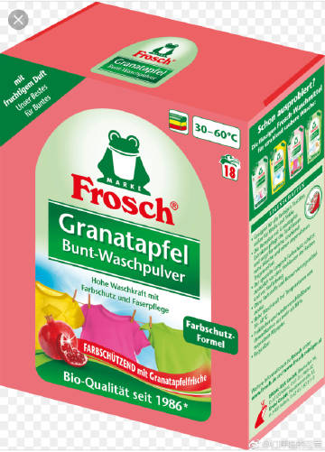
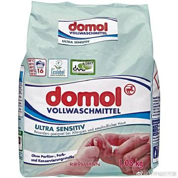
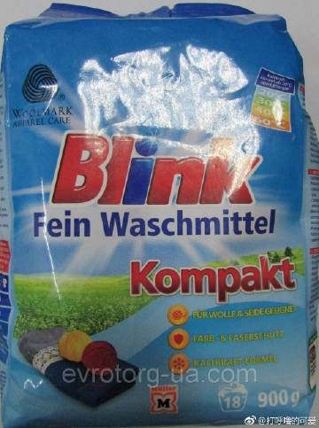
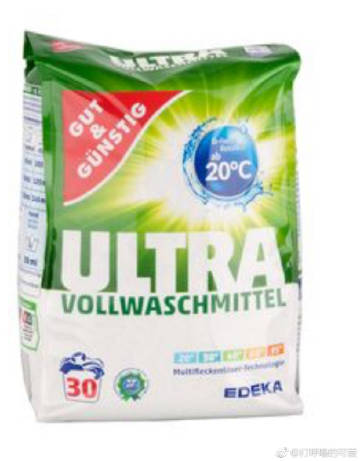

问:

日系产品所有包装说明书上没写是否可以“高温洗涤”的，我都发邮件去问厂商了，一两天就会给答复，比中国公司靠谱![[允悲]](images/2018new_kuxiao_org.png)。最新的回复是【所有的狮王洗衣液都不能高温，最高40度】。请问有什么洗衣粉、洗衣液可以在高温洗衣机里使用啊？

答：

日系产品我不熟悉，也没在日本研究过洗涤产品。但是从日本有的网友说“公共洗衣房里有的会写【不让洗内衣】”从这点能感受到：在日本，靠【高温洗涤】来消毒，可能并不是很普及的事情。而且，从日本的洗碗机普及率来感受的话，我觉得日系家务清洁更倾向于“靠勤奋苦干”来解决问题。

我说几个可以高温洗涤的洗涤剂，而且也很好用的。（我熟悉的是德国超市里面比较常见的品牌，所以这些是我的角度，如果你的所在国也有很多适合高温的洗衣粉，当然你自己就选择更多啦，可以瞅哪个打折买哪个）

1，Weisser Rieser洗衣粉，可用于20-95度，德国汉高的产品。

2，Persil洗衣粉，可用于20-95度，德国汉高的产品

3，OMO洗衣粉，可以用于40-95度，英国联合利华的产品

4，DM婴幼儿/特殊敏感人群洗衣粉（无香精无色素无防腐剂那种），可用于30-95度，德国DM出品

5，Tandil彩衣洗衣粉，20-60度，德国Aldi出品

6，Frosch彩衣洗衣粉，30-60度，德国Werner & Mertz出品

7，Domol婴幼儿/特殊敏感人群洗衣粉（无香精无色素无防腐剂那种），20-95度，德国Rossmann出品

8，Blink精细织物洗衣粉（真丝&羊毛都能洗），20-60度，德国Müller出品

9，Gut&Günstig洗衣粉，20-95度，德国Edeka出品。

总之，如果你仔细看这9张图片，德系洗涤产品都清晰的在外包装上写明了【适宜的温度】。温度信息为何重要呢，洗衣粉里面还会有一些活性酶，他们在某个温度段会有效，才能把你的洗衣粉的功力发挥到最大。甚至不用德国产，所有在德国卖的其他国家生产的洗衣粉，也都会很清楚的写明，根本不用到处打听。。。这就是我即使回国，一般都懒得买其他国家的洗衣粉的原因![[允悲]](images/2018new_kuxiao_org.png)清晰明了，让消费者省事儿。。。 毕竟“研究洗衣粉的使用温度”并非我的兴趣爱好所在，采购时的决策耗时越短越好。

