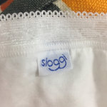

# 高温洗涤

以后我都会打这个标签来谈家务问题，便于大家搜索）

问：为什么我的内裤都不能95度洗涤？如果用高温了还放不放消毒液？高温洗衣服是不是特别费电？是不是特别浪费钱？

答：

1，应该买欧美品牌内裤，这样他的洗标是正确的。。。国内似乎所有内衣裤都为了“显得高档”都很爱写“必须轻柔手洗”之类的（我不确定，很多年没买过国内的了，网友留言说的）

2，德国牌子，如果你买白色/素色纯棉的，就可以95度（如图1-2）；德国牌子，如果你买花色/亮色纯棉的，就可以60度。。。这些【没有办法两全】，如果你要内衣都是亮片水钻假珍珠，瞅一眼就亮瞎他人，那就不能高温啊。但比如你追求卫生干净，像我这样特别喜欢高温洗涤的，就可以都买纯棉的。

3，所有的织物，如果用了【高温】就不用再放消毒液了。【高温】和【消毒液】是二选一的关系，不是应该双管齐下的关系。【高温60度&正常进行完洗涤程序】就可以杀死几乎所有常见的细菌病毒真菌孢子了（已经足够家用消毒，这是经过英国卫生部肯定的）。。。如果你们家住宿人员非常杂，有来路不明的保姆护工月嫂&表面抗原阳性公婆&肺炎支气管炎爸妈，那你就应该用高温90度洗涤（这也是德国医院餐厅的洗涤方式）

4，所有的消毒水几乎都是强氧化剂（本质上也属于一种化学污染），残余是会对你的皮肤/呼吸道有害的。有研究表明用消毒水/化学污染比较多的家庭容易过敏/致癌，而且容易给小孩增加一些遗传性/过敏性的疾病的可能性。也就是说，如果你能用【高温】，就不要再放【消毒水】。只有在实在不能选择高温的情况下，才应该选择消毒水。而不是优先选择用消毒水，为了省电省钱（不用加热了），你保养身体&多活两年，可以给家人多买好多电。

5，比如Miele高温洗衣机功率2.1kw，如你把它运行了2小时满打满算2.1*2=4.2度电，北京市1度电0.62人民币，4.2*0.62=2.6人民币【不到3元钱】，在北京连1个煎饼果子都买不到，能洗干净&消毒一大锅衣服（8公斤吧？），别的品牌也是类似的数据（只是我手头刚好有miele的功率，所以帮你算的miele的电价）。。。如果你连2.6元电费都觉得太心疼&太痛苦了，你恨不得一切都洗10分钟快洗，你就是只想花1毛钱电费，那也是可以的。。。那你就不要纠结于“洗的干净”还是“不干净”了，我劝你下暴雨的时候站在马路边儿顺道用衣服给自己背搓搓泥更省钱，别提电费了，连水费&搓澡巾都不用花钱了。

- 
- 