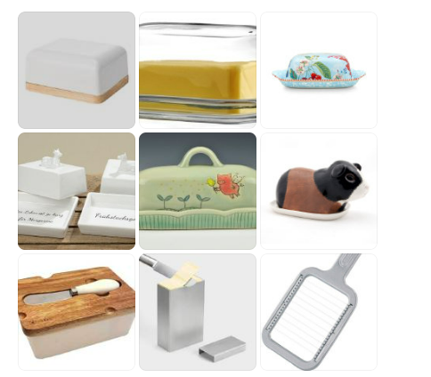

《黄油盒 & 黄油刀 & 黄油模子》

如果你在家里经常备有黄油的话，那么在铝箔纸上进行切割，非常容易把铝箔纸戳破，然后黄油的颜色会氧化变深 & 而且黄油非常容易冰箱里的吸附其他异味。如果你们家买的是一大坨黄油的话，早餐拿出来摆桌上，用纸包着也会看起来比较不美观。

这时候你就需要一个【黄油盒】，这也是欧洲一般比较好的酒店或餐厅给客人提供黄油的传统方法。

黄油盒有各种各样的，木头的、玻璃的、陶瓷的、不锈钢的。（1-6）

还有带“黄油刀”的（7）

还有可以推黄油，然后切割的（8）

一般，欧洲早餐，大家会使用【黄油刀】在面包上涂抹在室温下已经放软了的黄油，所以需要表面积比较大，但是不需要刀很锋利。。。所以说，一般的黄油刀都看起来是【矮胖的形状】，甚至还有木刀。（9A - 红线以上）

如果你经常做黄油炒蛋之类的，你需要【等分】你的大块黄油，那么你就需要一个【黄油切割器】，这种黄油切割器就能够帮你准确的平均的切割出大概20-25克。（9B - 红线以下&绿线以上）

如果你生活还在追求更加精致的路上![[允悲]](images/2018new_kuxiao_org.png)还可以就像做月饼&手工皂一样买【黄油模子】，传统的来说，一般都是木头的，有各种各样的印花，主要集中在花草和动物（牛&小鸟&猪&蝴蝶）上。（9C - 绿线以下）

总之，对器具的追求是可以无止境的，你要有钱也有力气，当然可以搞得更专业更漂亮更精致。

我科普的是和黄油相关的欧洲的常用工具（日常生活级别，好用&好清洁&体面&不难看&不寒碜的水平）。 

