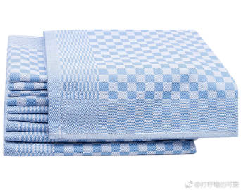

# 《不粘锅的正确使用》

如果你买了个不粘锅，那么就需要好好保养/正确使用，否则涂层剥落，对你/家人的健康有危害。涂层剥落的不粘锅是必须扔掉的。

1，【买个好的不粘锅】
特别劣质的不粘锅特别薄，做饭/炒蛋会受热不均匀，黄油一炒就糊。特别劣质的不粘锅，你就是再精心呵护，也把它无法保养成好锅。稻草再呵护也变不成金条的。好的不粘锅都是有一定厚度的，确保受热慢而均匀，和好的不锈钢锅是一样的（1）

2，【不要破坏涂层】
2A，炒菜必须拿【耐高温塑料铲/硅胶铲】。。。铁铲子刮几下你就可以把锅扔了（1-2）
2B，洗锅的时候（不管手洗&机洗），【不要炒完菜立刻冰水洗热锅】，要把锅放置到室温，这样涂层&锅体不会因为热胀冷缩的比例不同而涂层剥落
2C，如果手洗：
【不要用劣质洗碗钢丝球】，洗2次，你就是再好的锅，涂层也没了（3）
【应该用质量好的洗碗布比如scott之类的（国内叫“思高”）的黄色的柔软的海绵的那一侧进行洗涤】，而不是用深绿色的那种粗糙磨砂面（4）
2D，如果机洗：
首先，请再读一次第1条，买一个“适用于洗碗机的锅”才能用洗碗机洗。
其次，不粘锅可以扣在洗碗机里面机洗，但是如果你为了节省洗碗机，把不粘锅倒扣在一堆瓷盘子上的话，就又会刮坏涂层；
最后，如果你们家的洗碗块是有粗糙磨砂粒的那种，就会把不粘锅涂层划花，你用普通洗碗块即可。（谢谢网友补充）

3，【存放】
3A，一般人家都会至少有好几个锅，锅&锅摞在一起的时候，你可以在中间放这种【锅垫】（5-6）
3B，也可以在锅&锅之间，【放置干净漂亮的纯棉厨用抹布】（7-9）前提是你要有一个高温滚筒洗衣机而且舍得开60度，否则厨用抹布对“波轮洗衣机用户“又是完全的鸡肋。

4，【烹饪食品】
4A，如果你的不粘锅还不错，就别放一锅小石子儿做糖炒栗子![[笑cry]](images/d_xiaoku-f2bd11b506.png)别炒美国大龙虾/阳澄湖大闸蟹/大扇贝/法国大蜗牛/大骨头碴子。。。涂层经不起这样刮蹭
4B，保持中小火烹饪，不要空锅干烧很久，不要当炸锅用，油烟大了对做饭的人的肺部不利。

--- 

如果你完全做到以上几点，好的不粘锅的使用寿命是很长很长的，我自己的有的不粘锅用了多年，看着还和新的一样

> 
> 
> 
> 
> 
> 
> 
> 
> 

