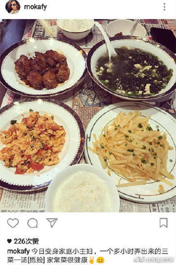
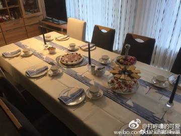
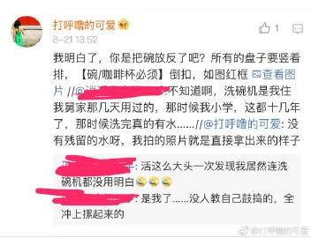
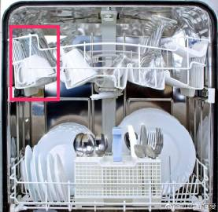
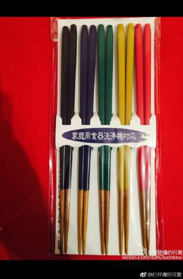
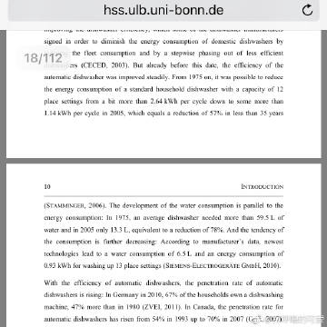

# 关于洗碗机的小科普 1/2

22.08.2017，《关于洗碗机的小科普 1/2》

（声明一下：本人不卖洗碗机、也不在任何洗碗机厂家工作，纯属打酱油的。）

很多年以前，大家不知道有没有看过一个中法厨师现场比拼，很多在海外华人都注意到了这么一个小细节（不好意思，我找不到原始视频链接了）如果是品尝一道菜的话，中国厨师就拿一个勺子去挖一点儿品尝，第二次品尝，还是继续拿这个勺子去挖一点儿品尝。法国厨师就不一样，就先用一个勺子去品尝，品尝完了以后，第二次去尝就会换一个勺子。。。显然如果你作为食客/评委，你肯定希望“以法国厨师的卫生习惯”来给你准备饭菜。有的网友就在评论里写“你看法国人做饭的卫生习惯就好”，其实这并不是单纯的“卫生习惯好”，这种表现就是【生活中“有洗碗机”还是“没有洗碗机”的区别】。中国餐厅都靠洗碗工，中国人家里靠自己手洗，所以大家能少洗一个就是一个，避免给餐厅/家里洗碗的那个人带来麻烦。但是西方发达国家的专业餐厅/大学食堂/公司茶水间/小家中，一般来说，在上个世纪80年代就普及了洗碗机。所以他们不存在“给别人添麻烦”这个事情，就可以尝一口饭/换一个勺子，保持了做饭的卫生。

再举一个特别小的例子，以前，郭天王家里铺了一张报纸，盘子碗勺子都不成套（图1）。别的网友高高兴兴地发帖，我就更不好意思给人泼冷水了，很多人晒美食的时候，都能看见湿乎乎的玻璃杯、有茶锈的茶缸。我在国内比较偏远的五星级酒店吃饭的时候，有时候还能遇见服务员把湿淋淋的盘子端上来![[二哈]](images/2018new_erha_org.png)。。。但是，这些情况就是在一般欧美普通人家里，都是让人觉得不太可以想象的（图2），这是我一个德国普通朋友过生日准备的茶歇。不管人家吃的合不合中国人的口味，但是盘子碗都成套、所有的餐具都干净整洁。这就是生活中“有洗碗机”和“没有洗碗机”的区别。

我以前科普过很多次洗碗机，但是都是零零散散的，今天准备写一篇长文，就不再零碎的科普了。

——————————————————————

1）问：我周围的朋友都说，洗碗机根本洗不干净碗

答：说“洗碗机洗不干净”的人，100%都没有用过洗碗机。![[微笑]](images/2018new_weixioa02_org.png)每次有人说洗碗机洗不干净，我都发这个效果图[微博正文](https://m.weibo.cn/1909203062/3726917448904001) 这是我自己的碗盘直接从洗碗机里拿出来的样子，干燥/洁净/温暖。

2）问：洗碗机洗完了以后有很多积水，那些积水特别脏。（如图3）
答：把碗放反了就是你说的这样。所有的盘子必须要竖着排，【碗/咖啡杯必须倒扣】，如图4红框（因为洗碗机的热水是从下往上冲洗的）

3）问：洗碗机可以放筷子吗？
答：如图4，最下层有一个塑料小篮子，老外拿着放刀子和叉子的，你放筷子就OK啊。（筷子注意粗的那头朝下放，因为有的筷子尖头特别尖，会从塑料小篮子的空隙插下去，会挡住最底部那个旋转的叶片。

4）问：普通筷子能用吗？
答：普通筷子不灵，油漆在这么高温环境下洗一洗就脱落了。。。我自己在日本买的洗碗机适用的筷子（图5） 很好用，而且漆洗不掉。有别的网友说国内IKEA有卖不锈钢筷子（空心儿）适用于洗碗机，还有网友说国内有卖不上漆的纯木筷子，也可以在洗碗机用（这两个我都没有实践过，仅供参考）。

5）问：锅能洗吗？
答：适用于洗碗机的锅都能洗，我的锅都换成适用于洗碗机的了。而且洗的超级干净。但是Staub呀、LC那种的铁锅/铸铁锅不能洗。

6）问：洗碗机特别费水？
答，洗碗机洗的比手洗的省水太多了。很多家住德国的朋友，都有过类似的经历，就是邀请父母到德国探亲以后，引起的【水费暴涨】，就是因为一般的中国父母特别不爱用洗碗机，因为他们觉得洗碗机费水。但是洗碗机要比手洗省水多了，德国波恩大学的研究显示，比如同样洗一大锅碗碟，洗碗机在1975年的款式耗水 59.5 L，2005年的洗碗机耗水 13.3 L，新款的2010年技术的洗碗机只用花【6.5 L水】（图6）。但是如果要让人手洗这么多同样量的碗碟，找的113个世界各国的测试者，平均使用了【103.0 L 水】（图7），也就是说手洗耗水量是2010年最新款洗碗机的15.85倍，即使你买个2005年技术水平的，手洗耗水量是2005年洗碗机的7.74倍。

7）问：洗碗机特别费电？
答：德国波恩大学的研究显示，在都用热水的情况下，洗碗机使用1-2 kwh 能源，手洗相同数量的碗碟平均使用2.5 kwh 能源，也就是说，手洗比洗碗机至少多用了25% 的能源，有可能多用了150%的能源。

8）问：洗碗机能消毒吗？
答：能（你不能当医用设备哈，但是餐饮消毒是足够的）。因为这是热水，50-80 ℃不等，哗啦啦洗2-3小时，就已经灭菌了（但是人手是经不住这么长时间的高温的）。而且洗碗块那种tab一般都是各种硅酸钠/过碳酸钠/硫酸钠/一些酶的合集（中学学过的啦，弱酸强碱盐，呈碱性），细菌病毒在碱性环境里早就灰飞烟灭了。。。

