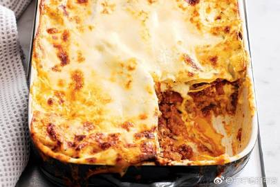
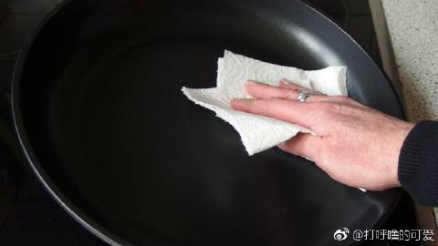
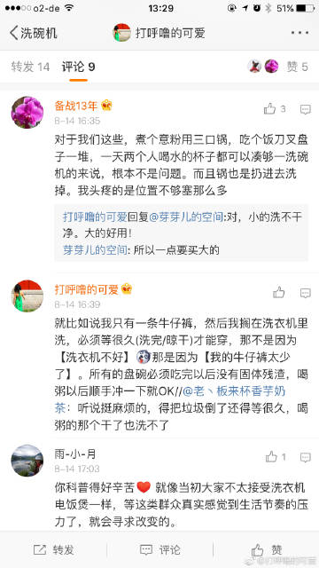
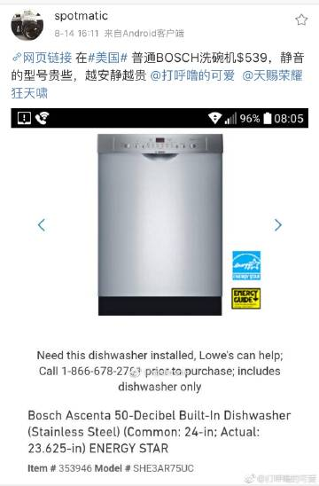
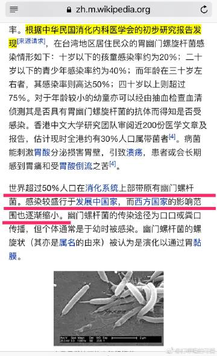
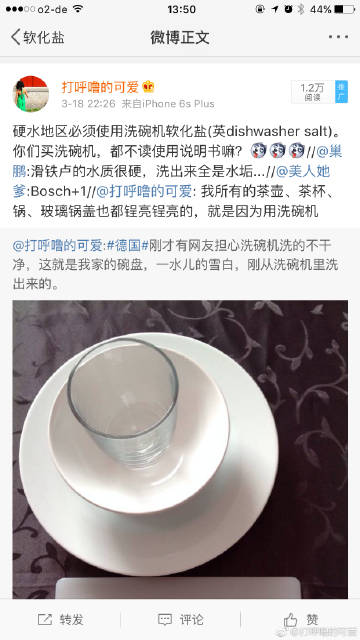
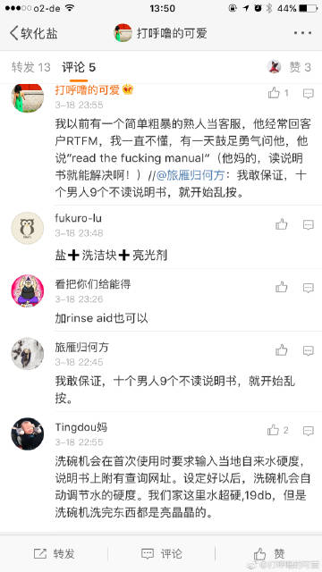

22.08.2017，《关于洗碗机的小科普 2/2》
（声明一下：本人不卖洗碗机、也不在任何洗碗机厂家工作，纯属打酱油的。）

9）问：油腻的盘子洗不干净？沾了蛋白质洗不干净？熬了粥，米糊干了，洗不干净？
答：能，西方国家人均吃肉蛋奶比中国人多太多了，而且还特别爱用烤箱烤蛋糕饼干奶酪，整天打发奶油/黄油，怎么可能洗不干净。。。你只要掌握了要领，都能洗干净。。。如果你做了勾芡/拔丝之类的粘锅的菜（或者是意大利千层面，奶酪干燥在烤盘上一大堆，如图1），那么，把锅/盆泡水里，把污垢【泡软】之后，用厨房纸巾把固体废物擦掉(图2），把锅【倒扣在洗碗机就OK】

10，问：案板也能洗吗？
答：我自己用的一套WMF的塑料案板，特别省地儿[微博正文](http://m.weibo.cn/1909203062/3941599551780907)  “好牌子”的塑料案板都写着【适用于洗碗机】如图绿框。不能买烂牌子的塑料制品，因为洗碗机一般加温到50-80度左右，特差的塑料会释放有害物质。。。如图Silit的塑料案板[查看图片](http://wx3.sinaimg.cn/large/71cc2076gy1fijol6jlqgj20qo15e78w.jpg)。。。如果你有洗碗机，就可以每顿吃完饭换一个案板，而且完全不用“生熟食案板分开”了，因为每顿做饭案板都可以用干净的案板。。。

11，问：洗碗机特别浪费时间？我经常在等洗碗机洗完碗呀，有时候等不及就手洗了。
答：就比如说我只有一条牛仔裤，然后我搁在洗衣机里洗，必须等很久(洗完/晾干/烘干)才能穿，那不是因为【洗衣机不好】，那是因为【我的牛仔裤太少了】。。。既然你都能买得起洗衣机了，麻烦你多买两件衣服![[二哈]](images/2018new_erha_org.png)；同理，既然你都能买得起洗碗机了，麻烦你也能多买点儿【成套的】盘/碗/碟/杯（理论上说你应该最好有能凑够2-3锅洗碗机的家当）。。。

12，问：中国三口之家一般一顿饭也就3副碗筷3-4个碟子呀，一盆水洗半盆水冲就行了，也不麻烦，用觉得再买个洗碗机有点浪费。
答：你这么说，说明：
第一，你们家杯子更换的不够频繁，
第二，说明你不刷案板，
第三，锅换的也不够频繁。
第四，你就是做个最简单的青椒苦瓜炒肉丝，也要用1个碗腌肉丝，1个盘子放葱姜蒜末，1个盘子放苦瓜片，再来1个盘子放青椒吧？荤素2案板/2刀，1炒锅/1铲子这就用了【10个餐具】
第五，按照你描述的方式，你们很有可能“不分餐”，强烈推荐在家也养成“分餐”的习惯，中国的幽门螺杆菌感染比例偏高，分餐很有意义（图5）。
说的直白一点儿，【我们所说的“卫生”不是一个标准】，所以【你觉得家有3个人洗碗机都凑不够一锅】（麻烦你再读一下“中法厨师的区别”，再读一下图3里面德国网友[@备战13年](https://weibo.com/n/备战13年) 的回答）比如我一个人在家，都能1-2天开一次洗碗机。

13，问：洗碗机洗出来真的不干净，我们这里水质特别硬，洗出来全是水垢。
答：RTFM: Read the Fucking Manual!请读说明书，（如图6，我的回答，如图7，德国网友[@Tingdou妈](https://weibo.com/n/Tingdou妈) 的回答）
德国盐叫“Spezialsalz für Spülmaschinen” (洗碗机软化盐)。洗碗机下面有圆孔容器(一般配漏斗)，把漏斗放在圆孔上，倒“软化盐”，再把盖子拧上，水硬的地区每月倒1次清洗盐。

14，问：洗碗机哪个好？
答：我跟你说个原则：【越大的越方便】（可以洗锅）；【越贵的越安静】。（图4来自米国网友[@spotmatic](https://weibo.com/n/spotmatic) ）
德国家庭一般常用Bosch，Siemens，如果家庭经济状况好些，会买Miele。（我不太熟悉日本和国产的洗碗机。所以说的是德国品牌）

【全文结束】

