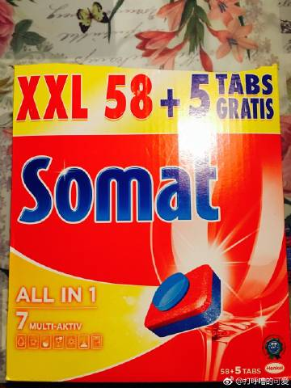
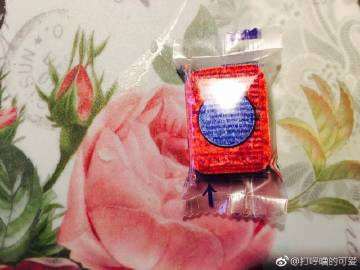
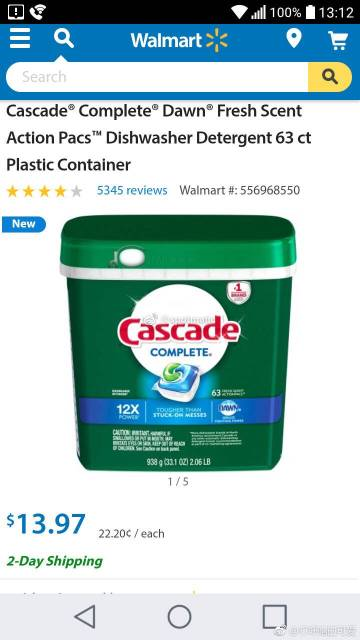
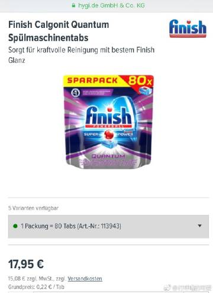
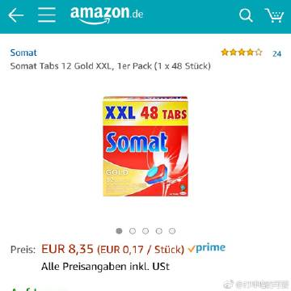
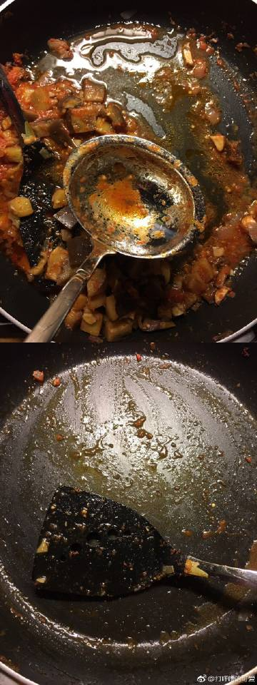
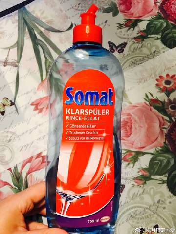
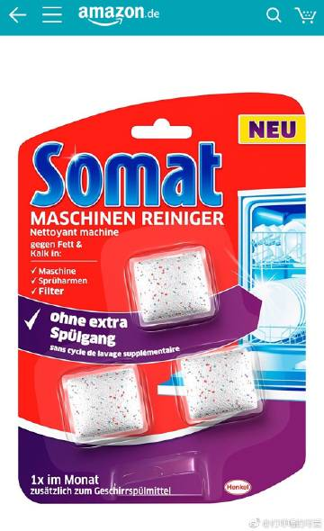
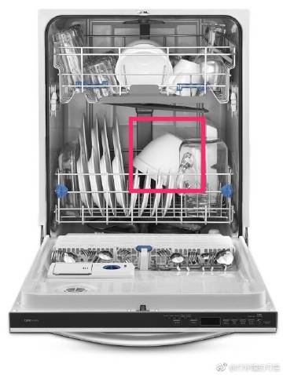

《写给洗碗机新手的一些补充问题，续文》

【请阅读以前我回答的14个问题，再提新的问题，读者众多，恕不能一一回答】

15，问：洗碗机用洗洁精吗？

答：洗碗机用的洗涤剂必须是“不起泡”的洗涤剂。欧洲用的一般是洗碗块。
       在欧洲，卖的最好2个牌子是Somat(德国汉高/也生产施华蔻洗发水)，Finish(英国利洁时/也生产杜蕾斯)。洗碗机如“体积大/牌子好”就不挑洗碗块，超市货也能溶解。我用过Siemens小型洗碗机，只溶解这俩好牌子的洗碗块。我现在用的是Miele大型洗碗机，就能溶解最便宜的超市自产品牌的洗碗块。
       美帝网友[@spotmatic](https://weibo.com/n/spotmatic) 介绍的：在美帝，通常用Cascade Complete洗碗块，一次一包（图3）
       中国的网友[@韵音和雅](https://weibo.com/n/韵音和雅) 介绍的，她特别喜欢Finish的Quantum洗碗块（图4）这个洗碗块就比一般洗碗块贵很多，效果也非常好。洗碗块贵贱不同，你最好多尝试一些不同的洗碗块，以找到最适合你家洗碗机的。（补充：这个Finish的Quantum洗碗块就相当于Somat的gold系列洗碗块，都是功能最强大的）
       大原则是【你洗碗机上省钱的话，就会在洗碗块上费钱】。欧美品牌的日化用品/家电基本上都是【一分钱一分货】![[并不简单]](images/2018new_bingbujiandan_org.png)

16，问：必须要预处理碗盘锅吗？
答：如果我这顿饭吃完马上就要洗一锅，那么就只要没有固体物质就OK。如果我这顿饭吃完还要等1天再洗，就拿张厨房纸巾把锅擦一下，或者用自来水把锅涮一下。比如做饭结束的锅，看起来是有点固体废物（图6上图），因为做饭结束马上准备洗一锅，用铲子拨拉掉（到图6下图的程度就OK），就连涮都不用涮就能直接放洗碗机里的。

17，问：洗碗机洗杯子结束有水痕，怎么办？
答：有可能你所居住的地区水质太硬，要添加软化盐（请看《2/2》的问答13）；另外，如果你这一锅的玻璃器皿比较多，你还需要添加“玻璃洗涤剂（洗碗机用）”（图7）

18，问：怎么清理洗碗机？
答：用专用的洗碗机清洗剂，你住的地方水质硬就1个月1次，你住的地方水质软（而且你平时把碗筷都预处理的比较干净再用洗碗机）你也可以3个月清洗一次，这个洗碗机清洗剂就在洗碗的过程中就可以清洗洗碗机了。。。（图8）

19，问：我知道“必须倒扣碗”，但是我发现洗碗机洗完以后，中式碗的碗底的下沿依然有积水，怎么办？
答：碗倒扣的意思不是“平行于水平面的倒扣”，请观察图9红框的碗，你可以把它想象成“有碗底下沿的中式碗”，你应该【倾斜 & 倒扣】，使碗底没有积水的可能。

问：洗碗机洗碗结束有蛋腥味道应该怎么做？

答：A，洗碗机每个月必须清洁，参考洗碗机问答18 ，请把隔网上的菜渣扔掉，按说明书清理即可。

B，家人对气味敏感，就应该放洗碗机去味剂（照片链接：[网页链接](https://m.weibo.cn/1909203062/4170782042987842)）

C，洗碗机去味剂放啥位置呢？
C1，如果你家的上层洗碗篮有一排小支架，把那个小挂钩挂在小支架上。（图2桃红箭头）
C2，如果你家的洗碗机是简陋版的老式的，你就可以把小挂钩挂在【上层洗碗篮的俯视图的蓝色区域】（图3），也就是说，你挂在上层洗碗篮的4角都是安全的（原则是【不允许妨碍上层洗碗篮连接的那个旋转叶片运转】，图2蓝箭头）

D，去味剂1周用1-2次即可，不用的时候拿出来放个干净干燥的地方就OK。Somat的这么一个去味剂可以用60次。你要是懒惰的话，一直挂在上层小支架上也可以，就是稍微有点儿浪费![[允悲]](images/d_yunbei-a14a649db8.png)

E，洗碗机长期不用的时候（比如你们全家度假半个月1个月），千万别拿个漂亮的布罩子罩起来，请把机门大开，保持【通风干燥】，否则，温暖潮湿阴暗容易滋生霉菌。

如果你家里没啥地方，【无法大开机门】，就拿2块那种干净干燥的Scotch Brite洗碗海绵（国内叫“思高”）塞在洗碗机门的左右，保持机门“半开”

1，木头铲子可以全部换成适用于洗碗机的塑料铲（图1-3）；2，Somat有洗碗机去味剂，叫“Somat DEO-Perls”，非常好用（4） [查看图片](https://weibo.cn/sinaurl?u=https%3A%2F%2Fwx2.sinaimg.cn%2Flarge%2F71cc2076gy1fl7csdtrhcj20qo2rvanj.jpg) //[@一隻特立獨行的豬](https://m.weibo.cn/n/一隻特立獨行的豬)：那我也问俩实质性问题好了： 1. 木头的放进去洗完就会弯掉怎么破？ 2. 我老公老嫌弃我用过蛋的餐具放进去洗全机的餐具都一股子腥味怎么破？

