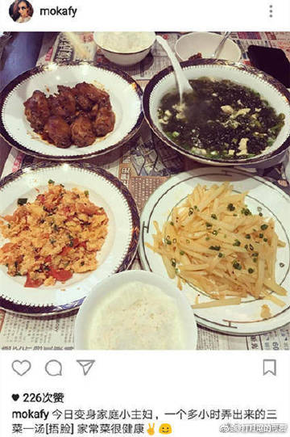
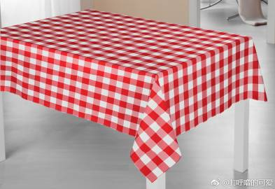
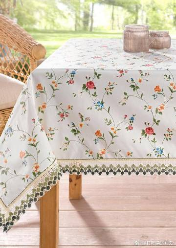
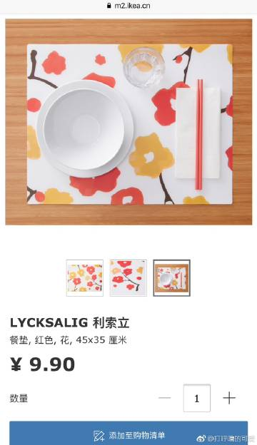
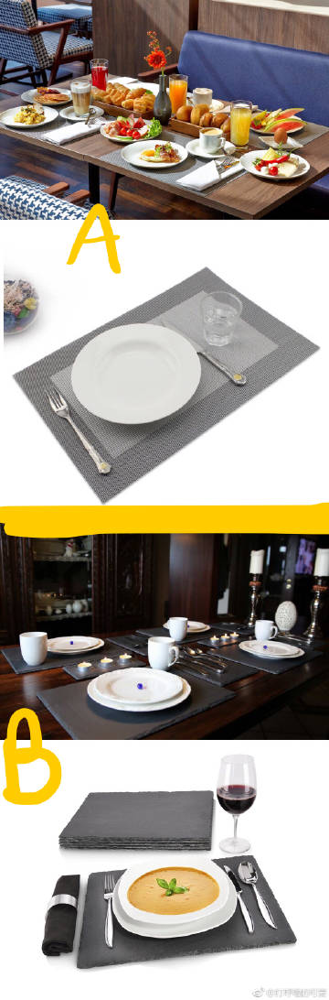
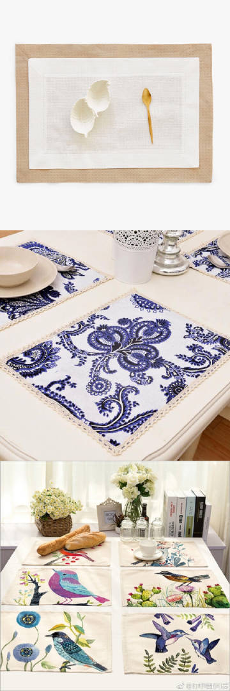
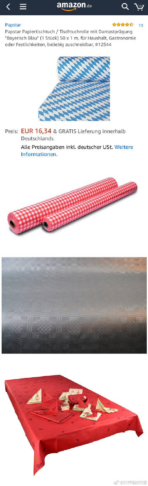
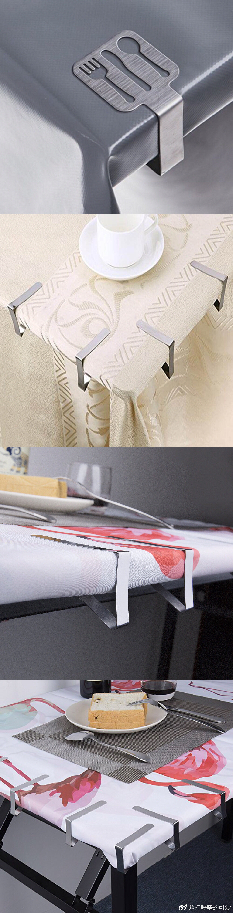

《关于“报纸铺桌子”的替代解决方案》

郭天王家的报纸铺桌子，吃饭就会看上去“不好看/不体面”，你就是尽心尽力做了满汉全席，放在报纸上也不会好看。。。报纸铺在桌子上，看上去那种仓促/狼狈/草率，让人一看他吃饭就觉得有“悲凉感”（堂堂天王![[允悲]](images/2018new_kuxiao_org.png)，图1）。我其实看过很多次有家长发孩子吃饭的照片，就是在报纸上吃，让我看了都觉得心酸。

你如果爱家庭爱小孩爱自己，真的就该稍微花点钱/心思，把家收拾得温馨一点。。。让我来介绍一下德国普通民众吃饭是怎么收拾桌子的，就是比较方便/好收拾/也不会让人一看就“满心悲凉”的做法（也不是“大宴宾客“的规格，日常生活的规格）。

1）【直接木桌】，然后擦桌子（图2）

2）【布的桌布，多买几块，脏了就换】，攒够一锅就洗（图3）一块桌布普通的（在德国买）也就是10欧左右，在中国更便宜。
如果你很怕脏/家里人多经常弄脏/洗衣机没有高温功能，你就多买几块化纤的桌布，更便宜更好洗。

3）【塑料桌布/防水桌布（德语的意思是“打蜡涂层桌布”Die abwaschbare Wachstuchdecke）】15欧左右就能看上去质感很好，不怕刮风下雨，也适合放在阳台/花园里面（图4）。

4）【餐垫Tischunterlage】至少要买4片/6片一套。。。
4-A），最便宜最常用的就是“一整片塑料的餐垫”（图5）可擦洗
4-B），酒店早餐/咖啡厅最常用的就是“编织的餐垫”有pvc涂层的高性能纤维（图6A）可擦洗，一般家居店都有卖，Ikea也有；类似的，还有最近比较流行的炭质板岩(DE:Schiefer, EN:Slate) 餐垫（图6B）也可擦洗。
4-C），“棉餐垫/布制餐垫”，需要经常换洗（图7）

5）【偷懒的办法：纸桌布/纸餐垫】一般越贵的套装就“越看不出来这是纸”![[允悲]](images/2018new_kuxiao_org.png)就看起来很像布（图8）。各大超市都有卖，根据各个季节/生日/节日会有所变化。比如每年过一次圣诞节，家里买圣诞桌布没意义（可用时间较短）就可以用纸的。或者过生日开派对（家里突然来很多人），也可以用纸的，亚马逊都50米一卷卖这些纸桌布。

6）【固定桌布的桌布夹】如果你家有儿童/老人做客（不希望小孩扯一把就拽反一桌菜）/在花园吃饭（不希望大风打翻了花瓶），就可以把桌布固定一下。

我以上说的都是【普通家用的基本解决方案】，比较方便实用/也不显得狼狈悲凉/也能很快收拾干净。。。桌布餐垫和别的生活用品一样，上不封顶，当然你还可以放更高级的东西/更高级的材质（桌旗/餐巾扣等等）

希望大家摆脱报纸当桌布，希望你和你爱的人生活都更美好

长图

