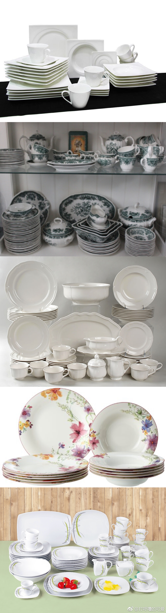
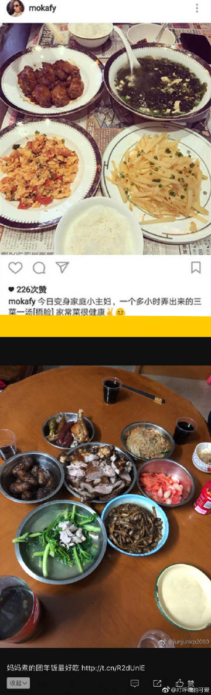
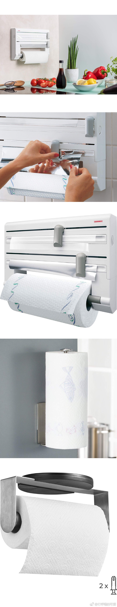
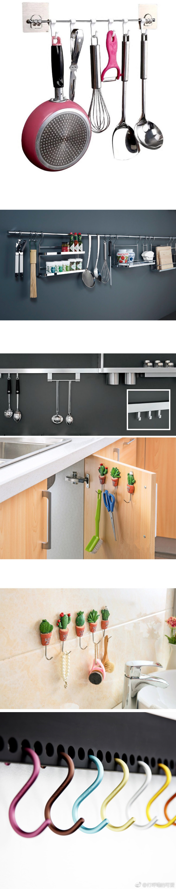

# 【厨房收纳小窍门】

（如果你家厨房无限大，或者有佣人/亲妈/亲老婆/亲老公收拾、如果你还在塑料袋里刨食不需要收纳的杠精，麻烦出门儿左转）

## 1，【精简物品】

尽量都买质量好的、好看的、有品牌的、称心如意的。买【贵一点的产品】能防止你购物狂热/拎回家一堆打折但是不太需要的。

凡是传世的/传家的/能用很多年的，无论东方西方，无论首饰/建筑/服装/茶具/厨具，都是以【精细/优雅/高档】为美。。。只有我们小时候，被爸妈老师忽悠的“艰苦朴素才叫美”，其实都是瞎扯八道。你去故宫/卢浮宫/梵蒂冈逛逛，没有一样东西是靠“艰苦朴素”流传下来的，艰苦朴素的最后都是粗制滥造的垃圾。

我们这些草根阶级的老百姓，出门儿度假/约会/面试/见客户/家里来访客都要倒持倒持，这是对人起码的尊重。但是如果【我们把自己当客户】![[嘻嘻]](images/2018new_xixi_org.png)就应该把自家厨房也搞好一点（在自己能力范围内）。

## 2，【家电都买（你经济承受能力内）最大/最贵/最好的】

洗碗机之类的东西，就像车/房子一样，我从来没有见过任何一个人说自己【车太大了&房子太大了】。我也从来没有见过任何一个人说【自己的洗碗机太大了】。

（图1），这是一个mm给我发的私信，后悔自己洗碗机买小了，非常可惜。。。还有人后悔买了消毒柜/还有人后悔自己图便宜买了个国产没牌子的（连装“软水盐”的地方都没有）。。。德国有一句谚语叫“ „Wer billig kauft kauft zweimal“（买便宜货的人，最后总得花更多的钱买第二遍）。

你开始就一次搞好，这是最省钱省时间省精力的方法。比你后来再扔了/再换代/再维修要强多了。洗碗机能买得起13套的人（家里也有地方的）就不要买6套/8套的。

## 3，【买成套餐具】

如果你厨房位置有限，需要收纳东西的时候，就应该买成套的餐具。因为成套的餐具都是互相平行的，摞在一起互相不打架/不妨碍（图2）如果你东买一个方碗，西买一个圆盘子，最后就很难摞在一起

而且成套餐具摆盘更容易好看（图3长图）

我知道很多人会说【日式餐具就是混搭/张三李四就是混搭餐具/YouTube名人就是混搭餐具】，但是这些餐具“混搭得好看”是建立在自己有相当的美学基础上。大部分普通人混搭出来的，真的一点都不美，只有【丑陋】俩字儿可以形容。（图4上，郭天王家。图4下，一个杠精家的年夜饭![[微笑]](images/2018new_weixioa02_org.png)）

再举一个例子就是[微博正文](https://m.weibo.cn/1909203062/4225411137617280)，这是[@盐光水灵-伊莎](https://weibo.com/n/盐光水灵-伊莎) 以前发的去朋友家小聚的照片，这就是欧美普通人的餐桌装饰一般都能能搞出来的程度。很显然“成套餐具”看起来更整齐更利落。

## 4，【善用空间】

如果你已经搞了成套餐具，家里柜子还是不那么够用![[允悲]](images/2018new_kuxiao_org.png)，可以挑选一些小工具，让你再次利用有限的地盘。举几个栗子![[嘻嘻]](images/2018new_xixi_org.png)

4A，【锅盖挂钩/锅盖架子】（比如ikea的VARIERA之类的，图5）有横有竖，还可以倒挂。

4B，【厨房纸巾/保鲜膜/铝箔架子】之类的，可以安装在厨房墙壁上、橱柜的下侧/内侧。（图6）

4C，【橱柜内部的分隔架】，还可以自己排列组合，固定出一个大个头儿的（图7）这样能充分利用空间

4D，【刀架】，可以竖着放、也可以搞个磁铁棒安装在墙上，把刀吸在上面（图8）

4E，【能挂的东西挂起来】（图9）有的可以挂在墙上，有的可以挂在橱柜内部，或者厨房门背后，成套的/品质好/风格统一的东西挂起来才好看，否则像个农村杂货铺

长图

长图

长图

长图

长图

长图

长图

